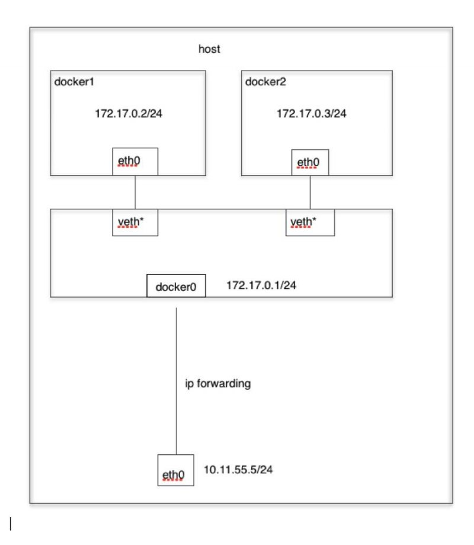
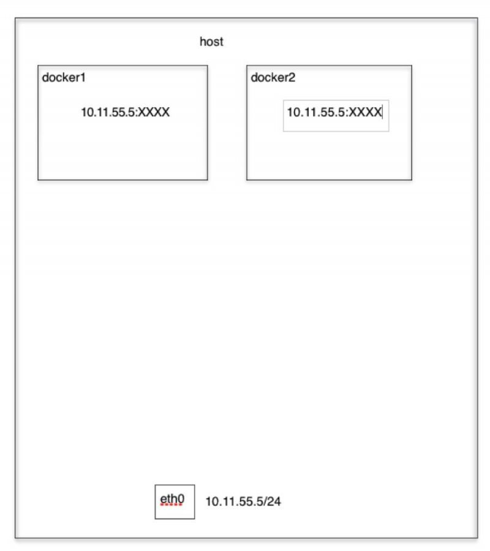
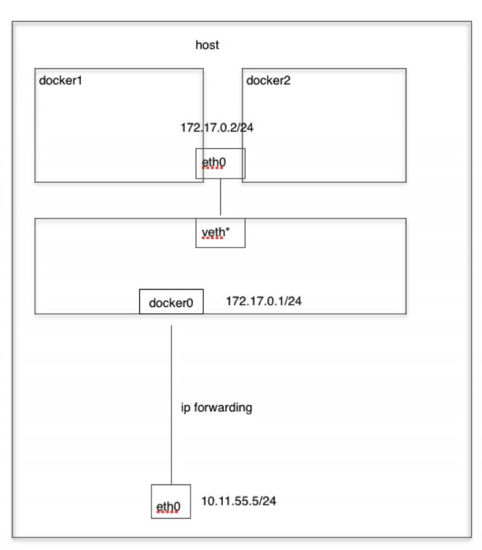

<center><h1>容器网络</h1></center>


## 1. 网络模式
&#160; &#160; &#160; &#160;

定义 | 描述
---|---
bridge| –net=bridge，默认网络，Docker启动后创建一个docker0网桥，默认创建的容器也是添加到这个网桥中。
host|-net=host,容器不会获得一个独立的network namespace，而是与宿主机共用一个。这就意味着容器不会有自己的网卡信息，而是使用宿主机的。容器除了网络，其他都是隔离的。
none|-net=none,获取独立的network namespace，但不为容器进行任何网络配置，需要手动配置。
container|-net=container:Name/ID,与指定的容器使用同一个network namespace，具有同样的网络配置信息，两个容器除了网络，其他都还是隔离的。
自定义网络|与默认的bridge原理一样，但自定义网络具备内部DNS发现，可以通过容器名或者主机名容器之间网络通信。

### 1.1 bridge
&#160; &#160; &#160; &#160;docker的默认使用bridge。当Docker进程启动时，会在主机上创建一个名为docker0的虚拟网桥，此主机上启动的Docker容器会连接到这个虚拟网桥上。虚拟网桥的工作方式和物理交换机类似，这样主机上的所有容器就通过交换机连在了一个二层网络中。

&#160; &#160; &#160; &#160;从docker0子网中分配一个IP给容器使用，并设置docker0的IP地址为容器的默认网关。在主机上创建一对虚拟网卡veth pair设备，Docker将veth pair设备的一端放在新创建的容器中，并命名为eth0（容器的网卡），另一端放在主机中，以vethxxx这样类似的名字命名，并将这个网络设备加入到docker0网桥中。可以通过brctl show命令查看。

&#160; &#160; &#160; &#160;bridge模式是docker的默认网络模式，不写--net参数，就是bridge模式。使用docker run -p时，docker实际是在iptables做了DNAT规则，实现端口转发功能。可以使用iptables -t nat -vnL查看。

<center></center>

```
docker run -tid --net=bridge --name docker_bri1 nginx
docker run -tid --net=bridge --name docker_bri2 nginx

brctl show
docker exec -ti docker_bri1 /bin/bash 
docker exec -ti docker_bri1 /bin/bash

ifconfig –a
route –n
```

??? note "操作"
    ```
    [root@localhost ~]# ifconfig
    docker0: flags=4099<UP,BROADCAST,MULTICAST>  mtu 1500
            inet 172.17.0.1  netmask 255.255.0.0  broadcast 172.17.255.255
            inet6 fe80::42:8aff:febb:5880  prefixlen 64  scopeid 0x20<link>
            ether 02:42:8a:bb:58:80  txqueuelen 0  (Ethernet)
            RX packets 57  bytes 7304 (7.1 KiB)
            RX errors 0  dropped 0  overruns 0  frame 0
            TX packets 81  bytes 5746 (5.6 KiB)
            TX errors 0  dropped 0 overruns 0  carrier 0  collisions 0
    
    ens33: flags=4163<UP,BROADCAST,RUNNING,MULTICAST>  mtu 1500
            inet 192.168.186.139  netmask 255.255.255.0  broadcast 192.168.186.255
            inet6 fe80::7bc6:bc62:db29:8a1b  prefixlen 64  scopeid 0x20<link>
            ether 00:0c:29:94:bd:ca  txqueuelen 1000  (Ethernet)
            RX packets 407793  bytes 562312090 (536.2 MiB)
            RX errors 0  dropped 0  overruns 0  frame 0
            TX packets 128762  bytes 8661406 (8.2 MiB)
            TX errors 0  dropped 0 overruns 0  carrier 0  collisions 0
    
    lo: flags=73<UP,LOOPBACK,RUNNING>  mtu 65536
            inet 127.0.0.1  netmask 255.0.0.0
            inet6 ::1  prefixlen 128  scopeid 0x10<host>
            loop  txqueuelen 1000  (Local Loopback)
            RX packets 408  bytes 29445 (28.7 KiB)
            RX errors 0  dropped 0  overruns 0  frame 0
            TX packets 408  bytes 29445 (28.7 KiB)
            TX errors 0  dropped 0 overruns 0  carrier 0  collisions 0
    
    
    
    [root@localhost ~]# docker run -tid --net=bridge --name docker_bri1 nginx
    9bcd1b5593257439bcc7cec9a23b6578bbbd60a003cad55bab764472259d181a
    
    [root@localhost ~]# docker run -tid --net=bridge --name docker_bri2 nginx
    3a9321502e283f0855deff50bf9abf279cbf02cd2712853af50cfb88a26dddeb
    
    [root@localhost ~]# ifconfig
    docker0: flags=4163<UP,BROADCAST,RUNNING,MULTICAST>  mtu 1500
            inet 172.17.0.1  netmask 255.255.0.0  broadcast 172.17.255.255
            inet6 fe80::42:8aff:febb:5880  prefixlen 64  scopeid 0x20<link>
            ether 02:42:8a:bb:58:80  txqueuelen 0  (Ethernet)
            RX packets 57  bytes 7304 (7.1 KiB)
            RX errors 0  dropped 0  overruns 0  frame 0
            TX packets 81  bytes 5746 (5.6 KiB)
            TX errors 0  dropped 0 overruns 0  carrier 0  collisions 0
    
    ens33: flags=4163<UP,BROADCAST,RUNNING,MULTICAST>  mtu 1500
            inet 192.168.186.139  netmask 255.255.255.0  broadcast 192.168.186.255
            inet6 fe80::7bc6:bc62:db29:8a1b  prefixlen 64  scopeid 0x20<link>
            ether 00:0c:29:94:bd:ca  txqueuelen 1000  (Ethernet)
            RX packets 407848  bytes 562316300 (536.2 MiB)
            RX errors 0  dropped 0  overruns 0  frame 0
            TX packets 128789  bytes 8666068 (8.2 MiB)
            TX errors 0  dropped 0 overruns 0  carrier 0  collisions 0
    
    lo: flags=73<UP,LOOPBACK,RUNNING>  mtu 65536
            inet 127.0.0.1  netmask 255.0.0.0
            inet6 ::1  prefixlen 128  scopeid 0x10<host>
            loop  txqueuelen 1000  (Local Loopback)
            RX packets 408  bytes 29445 (28.7 KiB)
            RX errors 0  dropped 0  overruns 0  frame 0
            TX packets 408  bytes 29445 (28.7 KiB)
            TX errors 0  dropped 0 overruns 0  carrier 0  collisions 0
    
    veth46caa6b: flags=4163<UP,BROADCAST,RUNNING,MULTICAST>  mtu 1500
            inet6 fe80::1897:a4ff:feeb:d0bf  prefixlen 64  scopeid 0x20<link>
            ether 1a:97:a4:eb:d0:bf  txqueuelen 0  (Ethernet)
            RX packets 0  bytes 0 (0.0 B)
            RX errors 0  dropped 0  overruns 0  frame 0
            TX packets 8  bytes 656 (656.0 B)
            TX errors 0  dropped 0 overruns 0  carrier 0  collisions 0
    
    vetha2c7d51: flags=4163<UP,BROADCAST,RUNNING,MULTICAST>  mtu 1500
            inet6 fe80::fc50:59ff:fe52:3738  prefixlen 64  scopeid 0x20<link>
            ether fe:50:59:52:37:38  txqueuelen 0  (Ethernet)
            RX packets 0  bytes 0 (0.0 B)
            RX errors 0  dropped 0  overruns 0  frame 0
            TX packets 8  bytes 656 (656.0 B)
            TX errors 0  dropped 0 overruns 0  carrier 0  collisions 0
    [root@localhost ~]# route -n
    Kernel IP routing table
    Destination     Gateway         Genmask         Flags Metric Ref    Use Iface
    0.0.0.0         192.168.186.2   0.0.0.0         UG    100    0        0 ens33
    172.17.0.0      0.0.0.0         255.255.0.0     U     0      0        0 docker0
    192.168.186.0   0.0.0.0         255.255.255.0   U     100    0        0 ens33
    可见启动了两个虚拟机网卡
    ```


### 1.2 host
&#160; &#160; &#160; &#160;如果启动容器的时候使用host模式，那么这个容器将不会获得一个独立的Network Namespace，而是和宿主机共用一个Network Namespace。容器将不会虚拟出自己的网卡，配置自己的IP等，而是使用宿主机的IP和端口。但是，容器的其他方面，如文件系统、进程列表等还是和宿主机隔离的。Host模式如下图所示：

<center></center>

```
docker run -itd --net=host  busybox
docker exec -it 容器id ifconfig
```

??? note "操作"
    ```
    [root@localhost ~]# docker run -itd --net=host  busybox
    7d0549a3e1aa4b60263adf72144d91a5aaa6694bc813ed0a51deb4874c2b8282
    [root@localhost ~]# docker exec -it 7d0549a3e1 ifconfig
    docker0   Link encap:Ethernet  HWaddr 02:42:8A:BB:58:80  
              inet addr:172.17.0.1  Bcast:172.17.255.255  Mask:255.255.0.0
              inet6 addr: fe80::42:8aff:febb:5880/64 Scope:Link
              UP BROADCAST RUNNING MULTICAST  MTU:1500  Metric:1
              RX packets:57 errors:0 dropped:0 overruns:0 frame:0
              TX packets:81 errors:0 dropped:0 overruns:0 carrier:0
              collisions:0 txqueuelen:0 
              RX bytes:7304 (7.1 KiB)  TX bytes:5746 (5.6 KiB)
    
    ens33     Link encap:Ethernet  HWaddr 00:0C:29:94:BD:CA  
              inet addr:192.168.186.139  Bcast:192.168.186.255  Mask:255.255.255.0
              inet6 addr: fe80::7bc6:bc62:db29:8a1b/64 Scope:Link
              UP BROADCAST RUNNING MULTICAST  MTU:1500  Metric:1
              RX packets:409454 errors:0 dropped:0 overruns:0 frame:0
              TX packets:129573 errors:0 dropped:0 overruns:0 carrier:0
              collisions:0 txqueuelen:1000 
              RX bytes:563238476 (537.1 MiB)  TX bytes:8758019 (8.3 MiB)
    
    lo        Link encap:Local Loopback  
              inet addr:127.0.0.1  Mask:255.0.0.0
              inet6 addr: ::1/128 Scope:Host
              UP LOOPBACK RUNNING  MTU:65536  Metric:1
              RX packets:412 errors:0 dropped:0 overruns:0 frame:0
              TX packets:412 errors:0 dropped:0 overruns:0 carrier:0
              collisions:0 txqueuelen:1000 
              RX bytes:29661 (28.9 KiB)  TX bytes:29661 (28.9 KiB)
    
    veth46caa6b Link encap:Ethernet  HWaddr 1A:97:A4:EB:D0:BF  
              inet6 addr: fe80::1897:a4ff:feeb:d0bf/64 Scope:Link
              UP BROADCAST RUNNING MULTICAST  MTU:1500  Metric:1
              RX packets:0 errors:0 dropped:0 overruns:0 frame:0
              TX packets:8 errors:0 dropped:0 overruns:0 carrier:0
              collisions:0 txqueuelen:0 
              RX bytes:0 (0.0 B)  TX bytes:656 (656.0 B)
    
    vetha2c7d51 Link encap:Ethernet  HWaddr FE:50:59:52:37:38  
              inet6 addr: fe80::fc50:59ff:fe52:3738/64 Scope:Link
              UP BROADCAST RUNNING MULTICAST  MTU:1500  Metric:1
              RX packets:0 errors:0 dropped:0 overruns:0 frame:0
              TX packets:8 errors:0 dropped:0 overruns:0 carrier:0
              collisions:0 txqueuelen:0 
              RX bytes:0 (0.0 B)  TX bytes:656 (656.0 B)
    可见容器内的网络是使用了宿主机的网络，没有再次创建docker的私有网络。
    ```


### 1.3 container
&#160; &#160; &#160; &#160;这个模式指定新创建的容器和已经存在的一个容器共享一个 Network Namespace，而不是和宿主机共享。新创建的容器不会创建自己的网卡，配置自己的 IP，而是和一个指定的容器共享 IP、端口范围等。同样，两个容器除了网络方面，其他的如文件系统、进程列表等还是隔离的。两个容器的进程可以通过 lo 网卡设备通信。

<center></center>

```
docker run -itd  --name taotaolinux busybox
docker run -tid --net=container:taotaolinux --name docker_con1 busybox
```
> 两个docker容器，使用一个网络

??? note "操作"
    ```
    [root@localhost ~]#  docker rm -f $(docker ps -a |awk '{print $1}')
    925479e72c73
    0c51527887a3
    Error: No such container: CONTAINER
    [root@localhost ~]# docker run -itd  --name taotaolinux busybox
    b1c62a22bfc9db38b69d234b0ba0745dd7a0a206b47e6420e442547990026162
    [root@localhost ~]# docker ps -l
    CONTAINER ID        IMAGE               COMMAND             CREATED             STATUS              PORTS               NAMES
    b1c62a22bfc9        busybox             "sh"                5 seconds ago       Up 4 seconds                            taotaolinux
    [root@localhost ~]# docker run -tid --net=container:taotaolinux --name docker_con1 busybox
    b74c16e949a9fa6cf17d5a05ab950db2440bbc0a874ab15657bdad70a1077981
    [root@localhost ~]# docker ps -l
    CONTAINER ID        IMAGE               COMMAND             CREATED             STATUS              PORTS               NAMES
    b74c16e949a9        busybox             "sh"                4 seconds ago       Up 3 seconds                            docker_con1
    [root@localhost ~]# docker exec -it b1c62a22bfc9 ifconfig
    eth0      Link encap:Ethernet  HWaddr 02:42:AC:11:00:02  
              inet addr:172.17.0.2  Bcast:172.17.255.255  Mask:255.255.0.0
              UP BROADCAST RUNNING MULTICAST  MTU:1500  Metric:1
              RX packets:8 errors:0 dropped:0 overruns:0 frame:0
              TX packets:0 errors:0 dropped:0 overruns:0 carrier:0
              collisions:0 txqueuelen:0 
              RX bytes:656 (656.0 B)  TX bytes:0 (0.0 B)
    
    lo        Link encap:Local Loopback  
              inet addr:127.0.0.1  Mask:255.0.0.0
              UP LOOPBACK RUNNING  MTU:65536  Metric:1
              RX packets:0 errors:0 dropped:0 overruns:0 frame:0
              TX packets:0 errors:0 dropped:0 overruns:0 carrier:0
              collisions:0 txqueuelen:1000 
              RX bytes:0 (0.0 B)  TX bytes:0 (0.0 B)
    
    [root@localhost ~]# docker exec -it b74c16e949a9 ifconfig
    eth0      Link encap:Ethernet  HWaddr 02:42:AC:11:00:02  
              inet addr:172.17.0.2  Bcast:172.17.255.255  Mask:255.255.0.0
              UP BROADCAST RUNNING MULTICAST  MTU:1500  Metric:1
              RX packets:8 errors:0 dropped:0 overruns:0 frame:0
              TX packets:0 errors:0 dropped:0 overruns:0 carrier:0
              collisions:0 txqueuelen:0 
              RX bytes:656 (656.0 B)  TX bytes:0 (0.0 B)
    
    lo        Link encap:Local Loopback  
              inet addr:127.0.0.1  Mask:255.0.0.0
              UP LOOPBACK RUNNING  MTU:65536  Metric:1
              RX packets:0 errors:0 dropped:0 overruns:0 frame:0
              TX packets:0 errors:0 dropped:0 overruns:0 carrier:0
              collisions:0 txqueuelen:1000 
              RX bytes:0 (0.0 B)  TX bytes:0 (0.0 B)
    ```

### 1.3 none
&#160; &#160; &#160; &#160;使用none模式，Docker容器拥有自己的Network Namespace，但是，并不为Docker容器进行任何网络配置。也就是说，这个Docker容器没有网卡、IP、路由等信息。需要自己为Docker容器添加网卡、配置IP等。

<center></center>


```
docker run -tid --net=none --name docker_non1 busybox
```

??? note "操作"
    ```
    [root@localhost ~]# docker run -tid --net=none --name docker_non1 busybox
    6340546f63b83fbfc3cddd5e52337dc4d567496a2b6ab504e29c049cb766da46
    [root@localhost ~]# docker ps -l
    CONTAINER ID        IMAGE               COMMAND             CREATED             STATUS              PORTS               NAMES
    6340546f63b8        busybox             "sh"                5 seconds ago       Up 5 seconds                            docker_non1
    [root@localhost ~]# docker exec -it 6340546f63b8 ifconfig
    lo        Link encap:Local Loopback  
              inet addr:127.0.0.1  Mask:255.0.0.0
              UP LOOPBACK RUNNING  MTU:65536  Metric:1
              RX packets:0 errors:0 dropped:0 overruns:0 frame:0
              TX packets:0 errors:0 dropped:0 overruns:0 carrier:0
              collisions:0 txqueuelen:1000 
              RX bytes:0 (0.0 B)  TX bytes:0 (0.0 B)
    ```

自定义网络

```
docker run -itd --name web busybox
docker run -itd --name db busybox
docker network create taotaolinux_network
docker run -itd --name web1 --net=taotaolinux_network busybox
docker run -itd --name db1 --net=taotaolinux_network busybox
docker exec -it web1 ping -c1 db1
docker exec -it db1 ping -c1 web1
```

??? note "操作"
    ```
    [root@localhost ~]# docker run -itd --name web busybox
    edf0be0c17e79a39db7b32a60d989ac3fbfe6d00491fb7308aa8c118fabb5b0c
    [root@localhost ~]# docker run -itd --name db busybox
    35c3c0f6cce62c8148469505806e82e67bbe123cfc3ddd6ddca946b2d43a2183
    
    [root@localhost ~]# docker exec -it web sh
    / # ping db
    ping: bad address 'db'
    / # [root@localhost ~]# docker exec -it db sh
    / # ping web
    ping: bad address 'web'
    / # [root@localhost ~]# 
    
    [root@localhost ~]# docker network  ls
    NETWORK ID          NAME                DRIVER              SCOPE
    fded918d7084        bridge              bridge              local
    7fb098cc4817        host                host                local
    bd86d4f496b9        none                null                local
     
    [root@localhost ~]# docker network create taotaolinux_network
    e08426e96c48d072c108352f43fb88134e1e451fb40eddf1be541cb25f11ad66
    [root@localhost ~]# docker network ls
    NETWORK ID          NAME                DRIVER              SCOPE
    fded918d7084        bridge              bridge              local
    e08426e96c48        taotaolinux_network         bridge              local
    7fb098cc4817        host                host                local
    bd86d4f496b9        none                null                local
    
    [root@localhost ~]# docker run -itd --name web1 --net=taotaolinux_network busybox
    607659807fbdf5f07849e496218c0f4c5b8fc65211f21d5098498cbaa3d4fa16
    
    [root@localhost ~]# docker run -itd --name db1 --net=taotaolinux_network busybox
    5ca91003c39e0157e416d0408d4f2a597e4eb009cde2c36e21dd56eda2b86dae
    
    [root@localhost ~]# docker exec -it web1 ping -c1 db1
    PING db1 (172.18.0.3): 56 data bytes
    64 bytes from 172.18.0.3: seq=0 ttl=64 time=0.121 ms
    
    --- db1 ping statistics ---
    1 packets transmitted, 1 packets received, 0% packet loss
    round-trip min/avg/max = 0.121/0.121/0.121 ms
    [root@localhost ~]# docker exec -it db1 ping -c1 web1
    PING web1 (172.18.0.2): 56 data bytes
    64 bytes from 172.18.0.2: seq=0 ttl=64 time=0.047 ms
    
    --- web1 ping statistics ---
    1 packets transmitted, 1 packets received, 0% packet loss
    round-trip min/avg/max = 0.047/0.047/0.047 ms
    
    其实是hosts文件中解析
    [root@localhost ~]# docker exec -it db1 cat /etc/hosts
    127.0.0.1	localhost
    ::1	localhost ip6-localhost ip6-loopback
    fe00::0	ip6-localnet
    ff00::0	ip6-mcastprefix
    ff02::1	ip6-allnodes
    ff02::2	ip6-allrouters
    172.18.0.3	5ca91003c39e
    [root@localhost ~]# docker exec -it web1 cat /etc/hosts
    127.0.0.1	localhost
    ::1	localhost ip6-localhost ip6-loopback
    fe00::0	ip6-localnet
    ff00::0	ip6-mcastprefix
    ff02::1	ip6-allnodes
    ff02::2	ip6-allrouters
    172.18.0.2	607659807fbd
    ```

查看新建网络信息

??? note "操作"
    ```
    [root@localhost ~]# docker network inspect taotaolinux_network 
    [
        {
            "Name": "taotaolinux_network",
            "Id": "e08426e96c48d072c108352f43fb88134e1e451fb40eddf1be541cb25f11ad66",
            "Created": "2019-04-15T01:44:55.96203805-04:00",
            "Scope": "local",
            "Driver": "bridge",
            "EnableIPv6": false,
            "IPAM": {
                "Driver": "default",
                "Options": {},
                "Config": [
                    {
                        "Subnet": "172.18.0.0/16",
                        "Gateway": "172.18.0.1"
                    }
                ]
            },
            "Internal": false,
            "Attachable": false,
            "Ingress": false,
            "ConfigFrom": {
                "Network": ""
            },
            "ConfigOnly": false,
            "Containers": {
                "5ca91003c39e0157e416d0408d4f2a597e4eb009cde2c36e21dd56eda2b86dae": {
                    "Name": "db1",
                    "EndpointID": "a03f17674d25f6d701cc82bd55f56f2ddd8e7195366279c44de43e0df8ccbeec",
                    "MacAddress": "02:42:ac:12:00:03",
                    "IPv4Address": "172.18.0.3/16",
                    "IPv6Address": ""
                },
                "607659807fbdf5f07849e496218c0f4c5b8fc65211f21d5098498cbaa3d4fa16": {
                    "Name": "web1",
                    "EndpointID": "a9af22b7a1d8a3288e7d4905c2235ad6321ac01d07dc289e7c7c66b7ebaaff33",
                    "MacAddress": "02:42:ac:12:00:02",
                    "IPv4Address": "172.18.0.2/16",
                    "IPv6Address": ""
                }
            },
            "Options": {},
            "Labels": {}
        }
    ]
    ```


## 2. 容器网络访问原理


