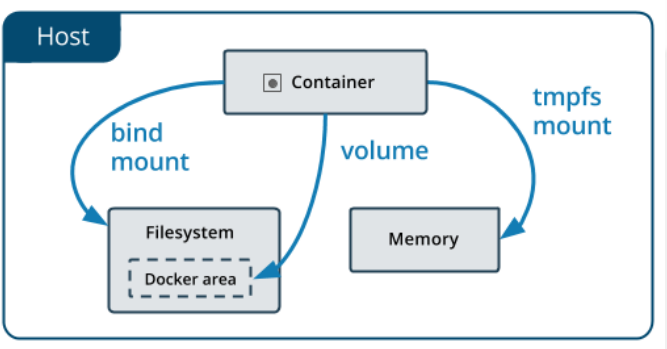

<center><h1>管理应用程序数据</h1></center>


## 1. 数据卷
### 1.1 简介
&#160; &#160; &#160; &#160;在Docker的使用过程中往往需要对数据进行持久化，或者需要在多个容器之间进行数据共享，所以这就涉及到Docker容器的数据操作。 
容器中数据管理主要有两种方式：数据卷和数据卷容器。

- 数据卷（Data Volumes） 容器内数据直接映射到本地宿主机。
- 数据卷容器（Data Volume Containers） 使用特定容器维护数据卷。

### 1.2 数据卷
&#160; &#160; &#160; &#160;数据卷是一个特殊的目录，它将主机目录直接映射进容器。可供一个或多个容器使用。

&#160; &#160; &#160; &#160;数据卷设计的目的就是为了 数据的持久化，它完全独立与容器的生命周期。因此，容器删除时，不会删除其挂载的数据卷，也不会存在类似的垃圾机制对容器存在的数据卷进行处理。

### 1.3 数据卷特点

- 数据卷在容器启动时初始化，如果容器使用的镜像在挂载点包含了数据，这些数据会拷贝到新初始化的数据卷中
- 数据卷可以在容器之间共享和重用
- 可以对数据卷里的内容直接修改，修改回马上生效，无论是容器内操作还是本地操作
- 对数据卷的更新不会影响镜像的更新
- 数据卷会一直存在，即使挂载数据卷的容器已经被删除


## 2. 数据卷挂载
&#160; &#160; &#160; &#160;Docker提供三种方式将数据从宿主机挂载到容器中

<center></center>

- volumes：Docker管理宿主机文件系统的一部分（/var/lib/docker/volumes）。保存数据的最佳方式。  
- bind mounts：将宿主机上的任意位置的文件或者目录挂载到容器中。  
- tmpfs：挂载存储在主机系统的内存中，而不会写入主机的文件系统。如果不希望将数据持久存储在任何位置，可以使用tmpfs，同时避免写入容器可写层提高性能。

> 其中tmpfs的数据只保存在容器的内存中暂不讨论，而Volumes也叫Docker Managed Volume。


### 2.1 Volume特点

- 多个运行容器之间共享数据。
- 当容器停止或被移除时，该卷依然存在。
- 多个容器可以同时挂载相同的卷。
- 当明确删除卷时，卷才会被删除。
- 将容器的数据存储在远程主机或其他存储上
- 将数据从一台Docker主机迁移到另一台时，先停止容器，然后备份卷的目录（/var/lib/docker/volumes/）

### 2.2 Bind Mounts特点

- 从主机共享配置文件到容器。默认情况下，挂载主机/etc/resolv.conf到每个容器，提供DNS解析。
- 在Docker主机上的开发环境和容器之间共享源代码。例如，可以将Maven target目录挂载到容器中，每次在Docker主机上构建Maven项目时，容器都可以访问构建的项目包。
- 当Docker主机的文件或目录结构保证与容器所需的绑定挂载一致时

### 2.3 volume
&#160; &#160; &#160; &#160;volume是docker上的数据卷使用的，而bindmount是和linux宿主机文件打交道的。
```
管理卷：
# docker volume create nginx-vol
# docker volume ls
# docker volume inspect nginx-vol

用卷创建一个容器：
# docker run -d --name=nginx-test --mount src=nginx-vol,dst=/usr/share/nginx/html nginx
# docker run -d --name=nginx-test -v nginx-vol:/usr/share/nginx/html 

nginx清理：
# docker stop nginx-test# docker rm nginx-test 
# docker volume rm nginx-vol

注意：
    1. 如果没有指定卷，自动创建。
    2. 建议使用--mount，更通用。
```

??? note "操作"
    ```python
    查看当前数据卷
    [root@localhost ~]# docker volume ls
    DRIVER              VOLUME NAME
    
    创建数据卷名字为nginx-vol
    [root@localhost ~]# docker volume create nginx-vol
    nginx-vol
    
    查看书卷
    [root@localhost ~]# docker volume ls
    DRIVER              VOLUME NAME
    local               nginx-vol
    
    查看数据卷详情
    [root@localhost ~]# docker volume inspect nginx-vol
    [
        {
            "CreatedAt": "2019-04-14T23:07:41-04:00",
            "Driver": "local",
            "Labels": {},
            "Mountpoint": "/var/lib/docker/volumes/nginx-vol/_data",   < --- 挂载点
            "Name": "nginx-vol",                                       < --- 数据卷名称
            "Options": {},
            "Scope": "local"
        }
    ]

    [root@localhost ~]# docker run -d -p 90:80 --mount src=nginx-vol,dst=/usr/share/nginx/html nginx
    3781a6fad3d7ed89e4c61831a776792539be47925e851bf4eb0acf970d68c88d
    [root@localhost ~]# ls /var/lib/docker/volumes/nginx-vol/_data/
    50x.html  index.html
    [root@localhost ~]# curl 127.0.0.1:90
    <!DOCTYPE html>
    <html>
    <head>
    <title>Welcome to nginx!</title>
    <style>
        body {
            width: 35em;
            margin: 0 auto;
            font-family: Tahoma, Verdana, Arial, sans-serif;
        }
    </style>
    </head>
    <body>
    <h1>Welcome to nginx!</h1>
    <p>If you see this page, the nginx web server is successfully installed and
    working. Further configuration is required.</p>
    
    <p>For online documentation and support please refer to
    <a href="http://nginx.org/">nginx.org</a>.<br/>
    Commercial support is available at
    <a href="http://nginx.com/">nginx.com</a>.</p>
    
    <p><em>Thank you for using nginx.</em></p>
    </body>
    </html>
    
    删除容器
    [root@localhost ~]# docker ps -l
    CONTAINER ID        IMAGE               COMMAND                  CREATED             STATUS              PORTS                NAMES
    3781a6fad3d7        nginx               "nginx -g 'daemon of…"   52 seconds ago      Up 51 seconds       0.0.0.0:90->80/tcp   elastic_sanderson
    [root@localhost ~]# docker rm -f 3781a6fad3d7
    3781a6fad3d7
    [root@localhost ~]# ls /var/lib/docker/volumes/nginx-vol/_data/
    50x.html  index.html
    删除完以后数据还在，做到了持久化了。
    
    修改源文件，再次挂载之前的数据卷
    [root@localhost ~]# echo '<h1>hello docker</h1>' > /var/lib/docker/volumes/nginx-vol/_data/index.html 
    [root@localhost ~]# docker run -d -p 90:80 --mount src=nginx-vol,dst=/usr/share/nginx/html nginx
    2178fc9052f918a2eb2b0ea790f4fcb8c2c075b567f707324b715b33339a6512
    [root@localhost ~]# curl 127.0.0.1:90
    <h1>hello docker</h1>
    说明正常。
    
    删除数据卷后，数据也没了
    [root@localhost ~]# docker rm -f $(docker ps -a |awk '{print $1}')
    2178fc9052f9
    ec0fcb3bf39a
    Error: No such container: CONTAINER
    [root@localhost ~]# docker volume rm nginx-vol
    nginx-vol
    [root@localhost ~]# ls /var/lib/docker/volumes/nginx-vol/_data/
    ls: cannot access /var/lib/docker/volumes/nginx-vol/_data/: No such file or directory


    没有定义数据卷，直接使用的话，就自动创建
    [root@localhost ~]# docker volume ls
    DRIVER              VOLUME NAME
    [root@localhost ~]# docker run -d -p90:80 --name=nginx-test --mount src=nginx-vol,dst=/usr/share/nginx/html nginx
    44e79c4c0b19be4bdd26d1fec5b1def72050072d5da480c6f1ed91a269f15624
    [root@localhost ~]# docker volume ls
    DRIVER              VOLUME NAME
    local               nginx-vol
    [root@localhost ~]# docker ps -l
    CONTAINER ID        IMAGE               COMMAND                  CREATED              STATUS              PORTS                NAMES
    44e79c4c0b19        nginx               "nginx -g 'daemon of…"   About a minute ago   Up About a minute   0.0.0.0:90->80/tcp   nginx-test
    [root@localhost ~]# curl 127.0.0.1:90
    <!DOCTYPE html>
    <html>
    <head>
    <title>Welcome to nginx!</title>
    <style>
        body {
            width: 35em;
            margin: 0 auto;
            font-family: Tahoma, Verdana, Arial, sans-serif;
        }
    </style>
    </head>
    <body>
    <h1>Welcome to nginx!</h1>
    <p>If you see this page, the nginx web server is successfully installed and
    working. Further configuration is required.</p>
    
    <p>For online documentation and support please refer to
    <a href="http://nginx.org/">nginx.org</a>.<br/>
    Commercial support is available at
    <a href="http://nginx.com/">nginx.com</a>.</p>
    
    <p><em>Thank you for using nginx.</em></p>
    </body>
    </html>
    ```

### 2.4 bind mounts
bind mount方式会覆盖原有的目录中文件。
```
 docker run -d -p99:80 --mount type=bind,src=$PWD/www_root,dst=/usr/share/nginx/html nginx
```


??? note "系统区别"
    ```python
    [root@localhost ~]# mkdir www_root
    [root@localhost ~]# docker run -d -p99:80 --mount type=bind,src=$PWD/www_root,dst=/usr/share/nginx/html nginx
    9cc33517a9ab1807756cb993920855dcfde73aac073f5cd2420b5eb60e7c6e74

    [root@localhost ~]# echo '<h1>hello docker bind mount</h1>'>www_root/index.html
    [root@localhost ~]# ls www_root/index.html 
    www_root/index.html
    [root@localhost ~]# curl 127.0.0.1:99
    <h1>hello docker bind mount</h1>
    ```
