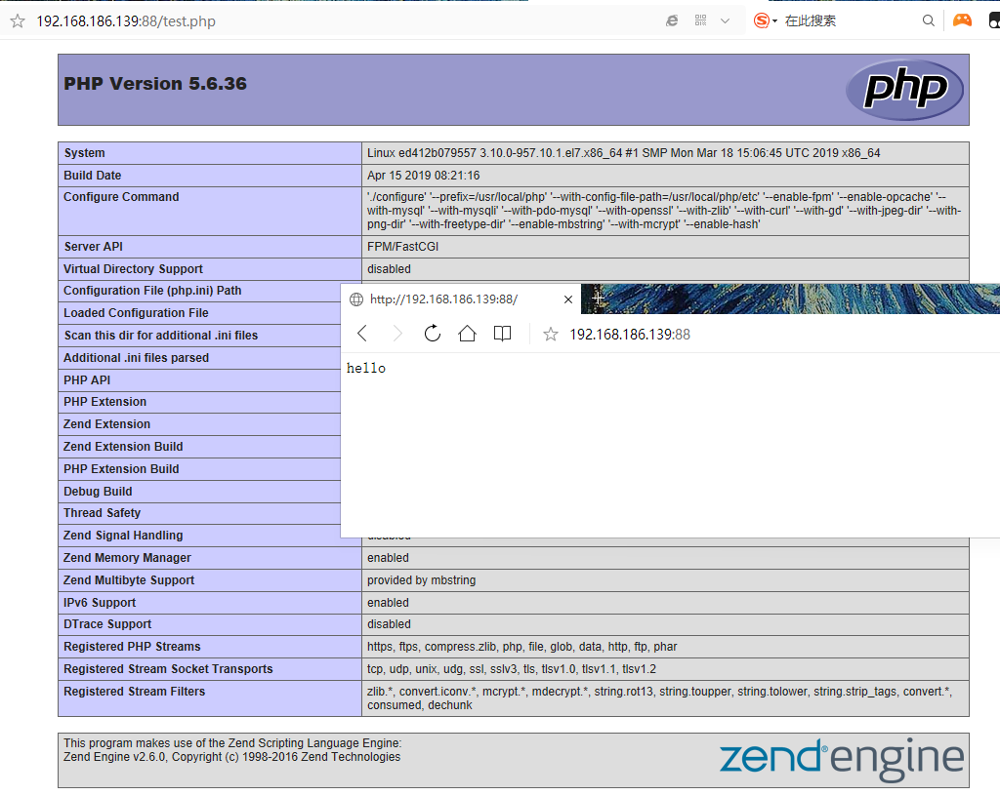
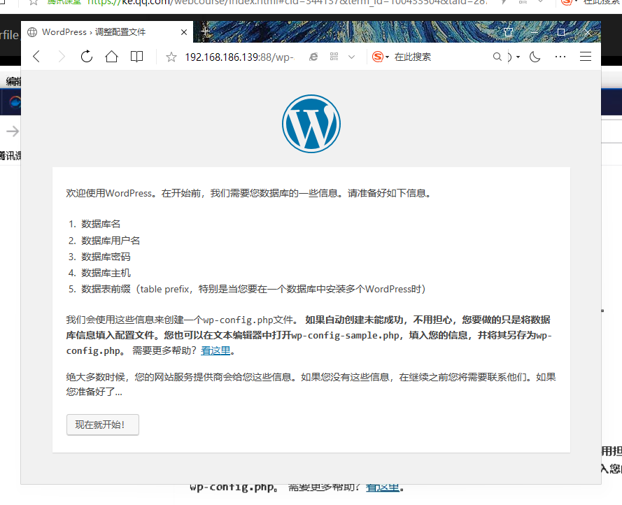
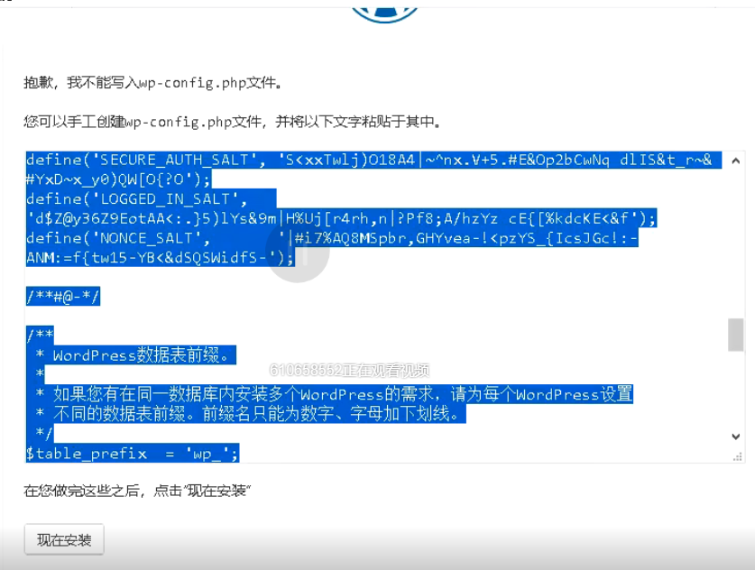
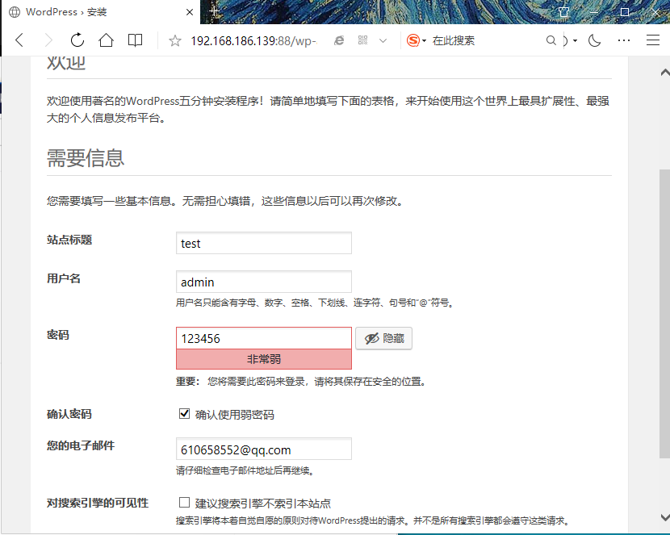
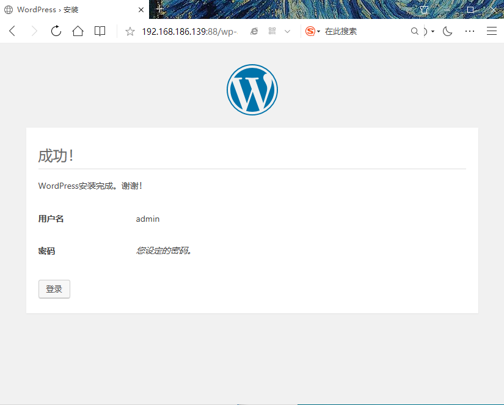
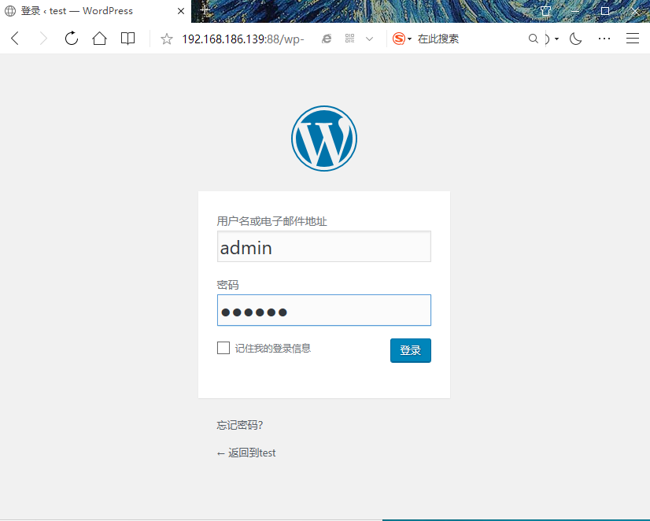
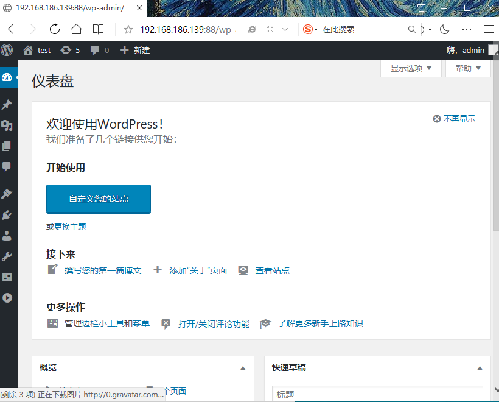

<center><h1>Dockefile</h1></center>

## 1. dockerfile
&#160; &#160; &#160; &#160;Dockerfile 是一个文本格式的配置文件，用户可以使用 Dockerfile 快速创建自定义的镜像。会先介绍 Dockerfile 的基本结构及其支持的众多指令，并具体讲解通过执行指令来编写定制镜像的 Dockerfile。

&#160; &#160; &#160; &#160;Dockerfile 由一行行命令语句组成，并且支持已 # 开头的注释行。一般而言，Dockerfile 的内容分为四个部分：基础镜像信息、维护者信息、镜像操作指令和容器启动时执行指令。


```
# This dockerfile uses the Ubuntu image
# VERSION 2
# Author: taotaolinux
# Command format: Instruction [arguments / command] …
 
# 第一行必须指定基于的容器镜像
FROM ubuntu
 
# 维护者信息
MAINTAINER taotaolinux 1785058042@qq.com
 
# 镜像的操作指令
RUN echo "deb http://archive.ubuntu.com/ubuntu/ raring main universe" >> /etc/apt/sources.list
RUN apt-get update && apt-get install -y nginx
RUN echo “\ndaemon off;” >> /etc/nginx/nginx.conf
 
# 容器启动时执行指令
CMD /usr/sbin/nginx
```

## 2. dockerfile指令

指令 |描述
---|---
FROM |构建新镜像是基于哪个镜像
MAINTAINER LABEL| 镜像维护者姓名或邮箱地址
RUN|构建镜像时运行的Shell命令
COPY| 拷贝文件或目录到镜像中
ENV| 设置环境变量
USER |为RUN、CMD和ENTRYPOINT执行命令指定运行用户
EXPOSE| 声明容器运行的服务端口
HEALTHCHECK| 容器中服务健康检查
WORKDIR| 为RUN、CMD、ENTRYPOINT、COPY和ADD设置工作目录
ENTRYPOINT| 运行容器时执行，如果有多个ENTRYPOINT指令，最后一个生效
CMD| 运行容器时执行，如果有多个CMD指令，最后一个生效

## 3. build镜像

```
Usage: docker build [OPTIONS] PATH | URL | - [flags]
Options:
    -t, --tag list # 镜像名称
    -f, --file string # 指定Dockerfile文件位置

docker build .
docker build -t shykes/myapp .
docker build -t shykes/myapp -f /path/Dockerfile /path
docker build -t shykes/myapp http://www.example.com/Dockerfile
```
> 点表示当前目录。

## 4. 构建

??? note "dockerfile nginx"
    ```
    FROM centos:7
    MAINTAINER taotaolinux
    RUN yum install -y gcc gcc-c++ make \
        openssl-devel pcre-devel gd-devel \
        iproute net-tools telnet wget curl && \
        yum clean all && \
        rm -rf /var/cache/yum/*
    RUN wget https://nginx.org/download/nginx-1.15.11.tar.gz && \
        tar zxf nginx-1.15.11.tar.gz && \
        cd nginx-1.15.11 && \
        ./configure --prefix=/usr/local/nginx \
        --with-http_ssl_module \
        --with-http_stub_status_module && \
        make -j 4 && make install && \
        rm -rf /usr/local/nginx/html/* && \
        echo "ok" >> /usr/local/nginx/html/status.html && \
        cd / && rm -rf nginx-1.15.11* && \
        ln -sf /usr/share/zoneinfo/Asia/Shanghai /etc/localtime
    
    ENV PATH $PATH:/usr/local/nginx/sbin
    COPY nginx.conf /usr/local/nginx/conf/nginx.conf
    WORKDIR /usr/local/nginx
    EXPOSE 80
    CMD ["nginx", "-g", "daemon off;"]
    ```

??? note "dockerfile php"
    ```
    FROM centos:7
    MAINTAINER taotaolinux
    RUN yum install epel-release -y && \
        yum install -y gcc gcc-c++ make gd-devel libxml2-devel \
        libcurl-devel libjpeg-devel libpng-devel openssl-devel \
        libmcrypt-devel libxslt-devel libtidy-devel autoconf \
        iproute net-tools telnet wget curl && \
        yum clean all && \
        rm -rf /var/cache/yum/*
    COPY php-5.6.36.tar.gz /
    #RUN wget http://mirrors.sohu.com/php/php-5.6.36.tar.bz2 && \
    RUN tar xf php-5.6.36.tar.gz && \
        cd php-5.6.36 && \
        ./configure --prefix=/usr/local/php \
        --with-config-file-path=/usr/local/php/etc \
        --enable-fpm --enable-opcache \
        --with-mysql --with-mysqli --with-pdo-mysql \
        --with-openssl --with-zlib --with-curl --with-gd \
        --with-jpeg-dir --with-png-dir --with-freetype-dir \
        --enable-mbstring --with-mcrypt --enable-hash && \
        make -j 4 && make install && \
        cp php.ini-production /usr/local/php/etc/php.ini && \
        cp sapi/fpm/php-fpm.conf /usr/local/php/etc/php-fpm.conf && \
        sed -i "90a \daemonize = no" /usr/local/php/etc/php-fpm.conf && \
        mkdir /usr/local/php/log && \
        cd / && rm -rf php* && \
        ln -sf /usr/share/zoneinfo/Asia/Shanghai /etc/localtime
    
    ENV PATH $PATH:/usr/local/php/sbin
    COPY php.ini /usr/local/php/etc/
    COPY php-fpm.conf /usr/local/php/etc/
    WORKDIR /usr/local/php
    EXPOSE 9000
    CMD ["php-fpm"]
    ```

??? note "nginx.conf"
    ```
    user                 nobody;
    worker_processes     4;
    worker_rlimit_nofile 65535;
    
    error_log  logs/error.log  notice;
    
    pid        /var/run/nginx.pid;
    
    events {
        use epoll;
        worker_connections  4096;
    }
    
    http {
    
        include       mime.types;
        default_type  application/octet-stream;
    
        log_format  main '$remote_addr - $remote_user [$time_local] "$request" '
                          '$status $body_bytes_sent "$http_referer" '
                          '"$http_user_agent" "$http_x_forwarded_for"';
    
        access_log off;
        keepalive_timeout  65;
    
        client_max_body_size         64m;
        server {
            listen 80;
            server_name www.ctnrs.com;
            index index.php index.html;
    
            access_log logs/www.ctnrs.com_access.log;
            error_log logs/www.ctnrs.com_error.log;
    
            # location ~ .*\.(js|css|html|png|gif|jpg|jpeg)$ {
            location / {
                root /wwwroot;
            }
    
            location ~* \.php$ {
                root /wwwroot;
                fastcgi_pass lnmp_php:9000;
                fastcgi_param SCRIPT_FILENAME $document_root$fastcgi_script_name;
                include fastcgi_params;
            }
        }
    }
    ```

??? note "dockerfile tomcat"
    ```
    FROM centos:7
    MAINTAINER taotaolinux
    
    ENV VERSION=8.0.46
    
    RUN yum install java-1.8.0-openjdk wget curl unzip iproute net-tools -y && \
        yum clean all && \
        rm -rf /var/cache/yum/*
    COPY apache-tomcat-8.0.46.tar.gz /
    #RUN wget http://mirrors.shu.edu.cn/apache/tomcat/tomcat-8/v${VERSION}/bin/apache-tomcat-${VERSION}.tar.gz && \
    RUN    tar zxf apache-tomcat-${VERSION}.tar.gz && \
        mv apache-tomcat-${VERSION} /usr/local/tomcat && \
        rm -rf apache-tomcat-${VERSION}.tar.gz /usr/local/tomcat/webapps/* && \
        mkdir /usr/local/tomcat/webapps/test && \
        echo "ok" > /usr/local/tomcat/webapps/test/status.html && \
        sed -i '1a JAVA_OPTS="-Djava.security.egd=file:/dev/./urandom"' /usr/local/tomcat/bin/catalina.sh && \
        ln -sf /usr/share/zoneinfo/Asia/Shanghai /etc/localtime
    
    ENV PATH $PATH:/usr/local/tomcat/bin
    
    WORKDIR /usr/local/tomcat
    
    EXPOSE 8080
    CMD ["catalina.sh", "run"]
    ```

> -f 指定dockerfile文件， -t 指定镜像名字

查看生成的nginx镜像
```
[root@localhost df]# docker images|grep -i v1
nginx               v1                  b4c9e11c4044        5 minutes ago       368MB
```

先下载好包

```
wget http://mirrors.sohu.com/php/php-5.6.36.tar.gz
wget http://mirrors.tuna.tsinghua.edu.cn/apache/tomcat/tomcat-8/v8.5.40/bin/apache-tomcat-8.5.40-src.tar.gz
```

构建

```
构建nginx
docker build -t nginx:v1 -f Dockerfile-nginx .

构建php镜像
docker build -t php:v1 -f Dockerfile-php .

构建tomcat
docker build -t tomcat:v1 -f Dockerfile-tomcat .
```

```
[root@localhost df]# docker images|grep v1
php                 v1                  4e102a80b17b        30 seconds ago      540MB
tomcat              v1                  199049d7998d        24 minutes ago      436MB
nginx               v1                  b4c9e11c4044        About an hour ago   368MB
```

## 5. 例子LNMP

<center></center>

### 5.1 自定义网络

```
docker network create lnmp
```

??? note "操作"
    ```
    [root@localhost df]# docker network create lnmp
    88ff654805e28d04863c8516fead5b26456874c28bf15c0df118ea6f065f1ba6
    [root@localhost df]# docker network ls|grep lnmp
    88ff654805e2        lnmp                bridge              local
    ```


### 5.2 创建mysql容器

```
docker run -d \
--name lnmp_mysql \
--net lnmp \
--mount src=mysql-vol,dst=/var/lib/mysql \
-e MYSQL_ROOT_PASSWORD=123456 -e MYSQL_DATABASE=wordpress mysql:5.7 --character-set-server=utf8
```
检查

```
[root@localhost df]# docker ps -l
CONTAINER ID        IMAGE               COMMAND                  CREATED             STATUS              PORTS                 NAMES
09b7ddfdc138        mysql:5.7           "docker-entrypoint.s…"   7 seconds ago       Up 6 seconds        3306/tcp, 33060/tcp   lnmp_mysql
```


> 具体参数详见https://hub.docker.com/_/mysql

### 5.3 创建php容器

```
docker run -d --name lnmp_php --net lnmp --mount src=wwwroot,dst=/wwwroot php:v1
```


### 5.4 创建nginx容器

```
docker run -d --name lnmp_nginx --net lnmp -p 88:80 \
--mount type=bind,src=$(pwd)/nginx.conf,dst=/usr/local/nginx/conf/nginx.conf --mount src=wwwroot,dst=/wwwroot nginx:v1
```

??? note "操作" 
    ```
    [root@localhost df]# docker run -d --name lnmp_nginx --net lnmp -p 88:80 \
    > --mount type=bind,src=$(pwd)/nginx.conf,dst=/usr/local/nginx/conf/nginx.conf --mount src=wwwroot,dst=/wwwroot nginx:v1
    ea3fc05c71abb198f4fc7fdce2a7c9de77291214c0d68de3f898d641a3c43b5a

    [root@localhost df]# mkdir wwwroot
    [root@localhost df]# ls
    apache-tomcat-8.0.46.tar.gz      Dockerfile-nginx.bak  dockerfile_.zip  php-5.6.36.tar.bz2  php.ini
    apache-tomcat-8.5.40-src.tar.gz  Dockerfile-php        nginx.conf       php-5.6.36.tar.gz   wwwroot
    Dockerfile-nginx                 Dockerfile-tomcat     php-5.6.36       php-fpm.conf
    [root@localhost df]# ls wwwroot/
    [root@localhost df]# docker run -d --name lnmp_php --net lnmp --mount src=wwwroot,dst=/wwwroot php:v1
    ed412b0795576e8f8245a4a6a87a0cefd8fc5c3fc1dee7b70c0bf9f045815063
    [root@localhost df]# docker volume ls
    DRIVER              VOLUME NAME
    local               mysql-vol
    local               nginx-vol
    local               wwwroot
    [root@localhost df]# docker ps -l
    CONTAINER ID        IMAGE               COMMAND                  CREATED              STATUS              PORTS                NAMES
    ea3fc05c71ab        nginx:v1            "nginx -g 'daemon of…"   About a minute ago   Up About a minute   0.0.0.0:88->80/tcp   lnmp_nginx
    [root@localhost df]# cd /var/lib/docker/volumes/wwwroot/_data/
    [root@localhost _data]# echo 'hello'>index.html
    [root@localhost _data]# echo '<?php phpinfo();?>'>test.php
    
    [root@localhost _data]# docker ps -a |grep lnmp
    ea3fc05c71ab        nginx:v1            "nginx -g 'daemon of…"   4 minutes ago       Up 4 minutes                   0.0.0.0:88->80/tcp    lnmp_nginx
    ed412b079557        php:v1              "php-fpm"                5 minutes ago       Up 5 minutes                   9000/tcp              lnmp_php
    09b7ddfdc138        mysql:5.7           "docker-entrypoint.s…"   8 minutes ago       Up 8 minutes                   3306/tcp, 33060/tcp   lnmp_mysql
    
    测试nginx首页
    [root@localhost _data]# curl 127.0.0.1:88
    hello
    
    测试test.php
    [root@localhost _data]# curl 127.0.0.1:88/test.php -I
    HTTP/1.1 200 OK
    Server: nginx/1.15.11
    Date: Mon, 15 Apr 2019 08:51:50 GMT
    Content-Type: text/html; charset=UTF-8
    Connection: keep-alive
    X-Powered-By: PHP/5.6.36

    ```
    
<center></center>

### 5.5 wordpress

```
[root@localhost _data]# pwd
/var/lib/docker/volumes/wwwroot/_data
[root@localhost _data]# ls
index.html  test.php  wordpress-4.9.4-zh_CN.tar.gz
[root@localhost _data]# tar xf wordpress-4.9.4-zh_CN.tar.gz 
[root@localhost _data]# mv wordpress/* .
```
开始访问

<center></center>

```
[root@localhost _data]# ls wp-config.php
wp-config.php
[root@localhost _data]# pwd
/var/lib/docker/volumes/wwwroot/_data
```

??? note "wp-config.php"
    ```
    <?php
    /**
     * WordPress基础配置文件。
     *
     * 这个文件被安装程序用于自动生成wp-config.php配置文件，
     * 您可以不使用网站，您需要手动复制这个文件，
     * 并重命名为“wp-config.php”，然后填入相关信息。
     *
     * 本文件包含以下配置选项：
     *
     * * MySQL设置
     * * 密钥
     * * 数据库表名前缀
     * * ABSPATH
     *
     * @link https://codex.wordpress.org/zh-cn:%E7%BC%96%E8%BE%91_wp-config.php
     *
     * @package WordPress
     */
    
    // ** MySQL 设置 - 具体信息来自您正在使用的主机 ** //
    /** WordPress数据库的名称 */
    define('DB_NAME', 'wordpress');
    
    /** MySQL数据库用户名 */
    define('DB_USER', 'root');
    
    /** MySQL数据库密码 */
    define('DB_PASSWORD', '123456');
    
    /** MySQL主机 */
    define('DB_HOST', 'lnmp_mysql');
    
    /** 创建数据表时默认的文字编码 */
    define('DB_CHARSET', 'utf8mb4');
    
    /** 数据库整理类型。如不确定请勿更改 */
    define('DB_COLLATE', '');
    
    /**#@+
     * 身份认证密钥与盐。
     *
     * 修改为任意独一无二的字串！
     * 或者直接访问{@link https://api.wordpress.org/secret-key/1.1/salt/
     * WordPress.org密钥生成服务}
     * 任何修改都会导致所有cookies失效，所有用户将必须重新登录。
     *
     * @since 2.6.0
     */
    define('AUTH_KEY',         'QqfN10u#M(]:E{a@z1{gdSQ=eyGE#3Tc7Yu~.woAa4x,!af51bV7+2>77@YDeC$`');
    define('SECURE_AUTH_KEY',  'krWu,FJewUB:0bNjq=vl<{2>r9u=X$bL,4txs,/:%Mj%;GpcS$U.PM#n?8+<YQ_n');
    define('LOGGED_IN_KEY',    'k#?u~v330n`+&V~Gcor0S$}m13yiqJOt`M[Tsy= Br{I*3W%;T:+^Es-i%;+o-.9');
    define('NONCE_KEY',        '7j=7];@h0hd2As^`4Aq)q&KIgztWmcq[ve$bjB%U:Tf(I81qT/~<]S=Lr]PD@]|4');
    define('AUTH_SALT',        '*V!G3.{.EgjPaeX-v*TR6]N z7je8hY!/YqfKpkpv>3qA]Lu,Y37%XYgjYl1q)`R');
    define('SECURE_AUTH_SALT', '{~x/NnO-zD%l^3IG8TGgg:(*.k.{!W{Hh|Xdd4hp-nL<Rv8|F&V^oO9et{<LYK})');
    define('LOGGED_IN_SALT',   '- >Jg>HmrNV$^rQCvb[2d&?w[25=aS-YI;jMw{R5X*a%(@OHBDn{jtw`,c#qOz`[');
    define('NONCE_SALT',       '$!3^dR5dvobG&/-C!av#F9@(WerH^HA.yxh)S4)83bf$WW#Bas_VDTl5gPSmzMQ0');
    
    /**#@-*/
    
    /**
     * WordPress数据表前缀。
     *
     * 如果您有在同一数据库内安装多个WordPress的需求，请为每个WordPress设置
     * 不同的数据表前缀。前缀名只能为数字、字母加下划线。
     */
    $table_prefix  = 'wp_';
    
    /**
     * 开发者专用：WordPress调试模式。
     *
     * 将这个值改为true，WordPress将显示所有用于开发的提示。
     * 强烈建议插件开发者在开发环境中启用WP_DEBUG。
     *
     * 要获取其他能用于调试的信息，请访问Codex。
     *
     * @link https://codex.wordpress.org/Debugging_in_WordPress
     */
    define('WP_DEBUG', false);
    
    /**
     * zh_CN本地化设置：启用ICP备案号显示
     *
     * 可在设置→常规中修改。
     * 如需禁用，请移除或注释掉本行。
     */
    define('WP_ZH_CN_ICP_NUM', true);
    
    /* 好了！请不要再继续编辑。请保存本文件。使用愉快！ */
    
    /** WordPress目录的绝对路径。 */
    if ( !defined('ABSPATH') )
    	define('ABSPATH', dirname(__FILE__) . '/');
    
    /** 设置WordPress变量和包含文件。 */
    require_once(ABSPATH . 'wp-settings.php');
    ```
    
<center></center>
<center></center>
<center></center>
<center></center>
<center></center>

到此结束。docker部署lnmp。
