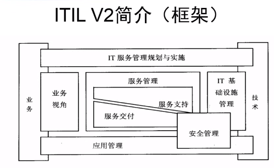

<h1>ITIL概述</h1>
  

###1. ITIL简介:
Information Technology Infrastructure Libarary(==信息技术基础架构库==)  
一套由OGC（英国政府商务办公室）开发，出版的书籍；描述了一套集成的==流程==，面向IT服务管理的==最佳实践==；世界范围内IT服务管理领域==事实上的标准==  
ITIL是IT服务管理的方法论，是一个框架，落地需要工具配合，主流工具：BMC Remedy、HP OpenView Service Manager  

###2.ITIL作用：
####2.1.提高IT服务管理（运维管理）的水平
- ==IT基础架构变得越来越复杂==  
- 破碎的、直通式的方式--》集成的、端到端的服务模式  
- 运营管理--》服务管理  
- 关注技术--》关注流程  
- 尽力而为--》服务级别管理，可控  
- 用户--》客户  

####2.2赢得客户信赖
- 全球范围内高度认可的IT服务管理最佳实践  
- 众多案例和典范  

####2.3优质的服务承诺
- 规范流程  
- 明确考核标准  
- 严格的质量  
- 控制体系  

####2.4降低成本
- 开始阶段需要一些投入  
- 随着IT服务管理成熟度的逐步提高，成本会逐步降低  

###3 框架
  

###4. 书籍
####4.1.《服务支持》：
介绍客户和==用户==如何获取恰当的服务来支持他们的活动和业务，含以下几个方面：    
- 服务台支持  
- ==事件管理==  
- 问题管理  
- 配置管理  
- 变更管理  
- 发布管理  

注意：==服务支持属于运营层面的东西==  
####4.2 《服务交付》
描述了==客户==需要用来支持其他业务运作的服务以及为提供这些服务所需的资源，含以下几个方面：  
- 服务级别管理  
- IT服务财务管理  
- ==能力管理==  
- IT服务持续性管理  
- 可用性管理  
注意：==服务交付属于战术层面的东西==

###5. 核心
Service Desk-->Service Delivery -->Service Support
  

###6. 例子
以软件开发为例  
- ==服务战略==：确定需求  
- ==服务设计==： 概要设计、详细设计  
- ==服务转换==： 编码、测试、上线  
- ==服务运营==： 客户开始使用软件  
- 持续服务改进： 不管改进软件的质量（一般不算）  

###7. 认证路线  
 

###7. ITIL价值成分
- 服务的功能(utility of a service)  
    一个产品能提供的服务或者满足特定需求的功能  
- 服务的功效(warranty of a service)  
    一种产品或服务能否满足协定需求的保证  

###8. 服务管理
==一套特定的组织能力==，它以服务的方式为客户提供价值  

###9. 服务提供商
- 内部服务提供商(Internal service provider)  
- 共享服务单元(shared services unit)  
- 外部服务提供商(external servicec provider)  

###10.ITSS
(Information TechnologyService Standards)信息技术服务标准，是在工业和信息化部、国家标准化委的领导和支持下，由ITSS工作组研制的一套IT服务领域的标准库和一套提供IT服务的方法论。
