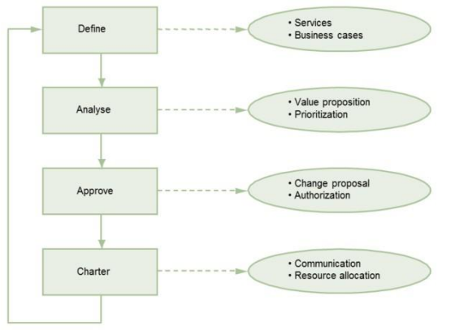
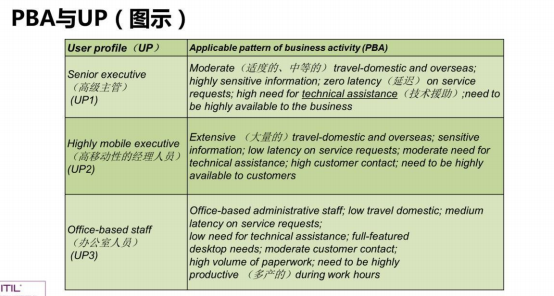
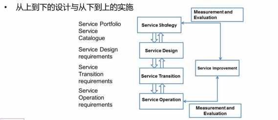

<h1>ITIL服务战略</h1>
 

###1.服务战略的概念
####1.1 4P原则：  
- Perspective(远景)  
描述组织的愿景和方向  
- Positions(定位)  
描述服务提供商打算在市场上如何与其他服务提供商竞争  
- Plans(计划)  
描述服务提供商如何从目前处境过渡到渴望的处境  
- Patterns(模式)  
描述服务提供商为了持续满足他们的战略目标而需要采取的持续、的可重复的行动  

####1.2利害干系人(Stakeholder in Service Management)：
- 组织(Organization)  
- 服务提供商(Serveice Providers)  
- 客户(Customers)  
- 用户(User)  
- 雇员(Employees)  
- 合作伙伴(Partners)  
- 供应商(Suppliers)  

####1.3 客户资产与服务资产
- 客户资产  
客户为了达到他们业务成果 而使用的任何资源或能力  

- 服务资产  
服务提供商为了向他们的客户交付IT服务而使用的任何资源或能力  

简单解释：  
- 客户资产就是客户所拥有的东西  
- 服务资产就是服务提供商所拥有的东西  
- 所谓“服务”，就是服务提供商通过他的“服务资产”让“客户资产”发挥更大的价值  

####1.4 流程、职能、角色
- 流程(Processes)  
1.流程是一套相关的活动，它为了达到某种结果而组合并实施资源和能力  
2.流程是一个==闭环系统==，因为他们利用==自加固和自修正==的行动来提供面向目标的更换和转换  
- 职能(Functions)  
1.专门执行某种类型的工作的组织单元  
2.为特定的输出负责  
3.构建组织去实施特殊的原则  
- 角色(Roles)  
1.流程所有者(Process Owner)  
2.流程执行经理(Process Manager)  
3.流程执行人员  

注意：
流程所有者和流程经理可能是同一个人  
流程不一定都是闭环的，有开环的流程和闭环的流程。只是ITIL 说它的流程都是闭环的。
职能是专门执行某种类型工作的组织单元，ITIL 中最典型的职能是“服务台”。  

####1.5 服务组合
- 服务管道(Service Pipeline)  
==所有在考虑中或者开发中的服务，对客户来说不可用==(all services that are under consideration or development,but are not yet aivalable to customers)  
- 服务目录(Service Catalogue)  
==所有“活的”服务，包括已经可以部署的服务==(all live IT service,including those available for deployment )  
- 退役服务(Retired Services)  
所有已经被淘汰或者退役的服务(all services that hava been phased out or retired)  

###2. 服务战略的流程(Service Strategy Processes)
####2.1 IT服务战略管理(Srtategy Management for IT Service) 
- 目的  
1.定义和维护一个组织的服务和服务管理战略的4P原则  
2.保证这些战略被定义、维护并达到他的目的  

- 目标  
1.==分析内部和外部环境，以发现能使组织受益的机会==  
2.识别可能组织达到业务成果的约束  
3.协商服务提供商的远景，并定期回顾  
4.建立服务提供商相对客户和其他服务提供商的位置  

- 策略、原则和基本概念(Policies,principles and basic concept)   
1.一个组织的战略是由其管理者指定的  
2.==如果是外部服务提供商、那服务战略将是组织战略的核心组成部分==  
3.==对于内部服务提供商来说，服务战略将支持整个企业的战略==  

- 流程活动、方法和技术  
1.战略评估  
2.战略产生、评价和选择  
3.战略执行  
4.度量和评价  

- 流程的主要KPI  
1.愿景和使命已经被定义，员工已经被培训并明确他们的校色和工作的意义  
2.每个业务单元都有一个明确的战略计划，它清楚的表明该业务单元的活动如何与组织的愿景，使命和目标连接
3.审计结果表明，每一个利害干系人手里都有一个更新的、适当的计划文档的拷贝  
4.利害干系人能够提供一个与他们业务员单元有关的战略问单反内容的概览  
5.==所有文档都在控制之下，对文档的改变要走变更流程==  

####2.2 服务组合管理(Service Portfolio Management)  
- 目的和目标
1.目的(Purpose)
==保证服务提供商有一个适当的服务组合,以在IT投资与满足业务成果的能力之间做出平衡==  
对服务的整个生命周期进行跟踪，并与其他的服务管理流程合作，以保证适当的投资回报  

2.目标(Objective)
提供一个流程和机制，使组织能够基于潜在的汇报和可接受的风险级别，调查并决定提供那些服务  
维护服务组合的最终定义，阐明每个服务满足的业务需求和它所支持的业务成果  
提供一种机制，使组织能够评估服务如何能够实现他的战略，并对内部和外部的环境的变更做出响应  

- 范围(scope)
服务组合管理的范围是一个服务提供商提供的所有服务，包含以下几点：  
1.计划交付的服务  
2.已经交付的服务  
3.已经撤退的服务  

- 策略、原则和基本概念(Policies,Principles and basic concept)  
1.服务组合(service portfolio)  
2.服务管道(service pipeline)  
3.服务目录(service catalogue)  
4.退休的服务(retires services)  
5.配置管理系统(cms)  
6.应用程序组合(application portfolio)  
7.客户组合(customers portfolio)  
8.供应商组合(supplier portfolio)  

- 流程活动、方法和技术(process activities,methods and techniques)
服务组合的四个阶段：  
 

- 流程的主要KPI  
1.组织战略检查表明，所有变更的业务目标和成果持续被服务组合中的服务所满足  
2.对每一个服务的==投资==都在服务组合中被量化  
3.对每一个服务的==投资==都被记录下来  
4.==投资== 与项目汇报预测是一致的  
5.已退休的服务数量   
6.==退休之后又重新安装的服务的数量==  

注意：
关键词“投资”，因为服务组合管理的重点是要引进新的服务（包括升级的服务），而引进新的服务肯定是要花钱的  
考核“已退休的服务的数量”是很有必要的，因为服务组合管理流程的主要目的就是“保证服务提供商有一个适当的服务组合”  
“退休之后又重新安装的服务的数量”应该被认为是一个不好的指标，因为它起码表示你在让一个服务退休时考虑的不够周到  

####2.3 IT服务财务管理(Financial Manangement for IT Service)  
- 目的  
1.保证有适当的级别的资金去设计、开发和交付服务、以匹配组织的战略  
2.保证服务提供商不对那些他们不能提供的服务做出承诺  
3.负责平衡IT服务的成本也质量，以及提供与需求  

- 目标  
1.定义一个用于识别，管理和沟通所提供服务的成本的架构  
2.评估服务提供商新的或变更的战略对财务的影响  
3.保证服务提供的资金安全  
4.理解花费与收入之间的关系，并保证两者按照组织的v爱武政策是平衡的  
5.预测组织的财务需求，以保证它能够满足对客户的服务承诺  

- 范围(scope)  
1.==预算(budgeting):预测和控制组织内金钱的收入和支出==   
2.==核算(accounting):充分说明钱是怎么花的==  
3.==收费(charging):就所提供的服务向客户收费==  

- 企业财务管理策略  
1.成本中心  
指被分配了成本，但没有对所提供的服务收费的业务单元或部门  
2.利润中心  
对所提供的服务收费的业务单元  

####2.4 需求管理(Demand Management)  
- 目的  
1.==理解、预计和影响客户对于IT服务的需求==  
2.==与容量管理协同工作==，以保证服务提供商具有满足需求的容量  

- 目标  
1.识别和分析==业务活动模式==，以理解对服务的需求级别  
2.定义和分析==用户需求==，以理解来自不同用户的典型需求  
3.保证服务的设计是按照pba来进行，并具有满足业务成果的能力  
4.==与容量管理协同工作，以保证有充足的资源可用==  
5.预计并组织或管理对服务的需求超出交付服务的容量的情况  
6.合理安排资源的使用，以应对服务需求的波动  

- 范围(scope)  
1.识别和分析与服务有关的业务活动模式(==PBA==)  
2.识别用户需求(==UP==)并分析他们的服务使用模式  
3.与==容量管理==一起，去识别、协商和实施能够影响需求的措施  
 

- 流程活动、方法和技术  
1.业务计划(business plans)  
2.市场计划和预测(marking plans and forecasts)  
3.生产计划(production plans)  
4.销售预测(sakes forecasts)  
5.新产品发布计划(new product launch plans)  

- 流程活动、方法和技术 (中国移动为例)  
1.战术层面：  
错峰计价  
批量优惠  
2.战略层面  
细分市场/差异化服务  
核心服务/支持服务  

- 流程主要KPI  
1.每一个相关服务都定义了PBA  
2.PBA已经被容量管理转换为工作量信息  
3.归档存在用户的需求，每一个都包含这类用户对服务需求的轮廓  
4.把需求管理作为定义服务组合的一部分  
5.容量计划包含PBA细节，以及相应的负载  
6.利用率监视表明负载是平衡的  
7.管理需求的方法已经被归档在容量计划中，而且在服务级别协议的适当地方也会被提到  
8.==差异化收费已经导致在整个服务时段内更均匀的需求==  

####2.5 业务关系管理(Businedd Relationship Mangement)  
- 目的  
1.==基于对客户和他们业务需求的理解，在服务提供商和客户之间简历和维护业务关系==  
2.识别客户的需求，并保证服务提供商能够保证满足这些需求  

- 目标  
1.保证服务提供商能够理解客户对服务的远景  
2.保证高级别的客户满意度  
3.==在服务提供商和客户之间建立和维护一种建设性的关系==  
4.识别客户环境的变更，因为这可能会影响服务提供的类型、级别或使用  
5.==识别技术发展趋势，因为这可能会影响服务提供的类型、级别或使用==  

- 范围  
1.==对于内部服务提供商，业务关系管理典型的来自IT部门的高级代表与业务单元高级经理来执行==  
2.==对于外部服务提供商，业务关系管理通常由单独的职能部门或客户经理来执行==  

- 流程活动、方法和技术  
1.业务关系管理流程不是客户就是被服务管理流程或职能来启动，==通常是通过练习BRM(角色)==  
2.BRM必须维护一个关于所有机会、需求、抱怨和表扬的登记表，以对他们进行追踪、从而保证他们不会落入不同的流程和职能之间  
3.客户需要一种方式去与服务提供商沟通他们呢的需求、机会和要求，而且是正式的、有组织的方式  
4.客户直接与开发人员和技术团队’接口‘ 并不是最佳的方法，尽管有时需要  
5.==业务关系管理流程为所有的客户需求提供一个协调点==  

注意：
业务关系经理（BRM）， 是 IT 部门的人，他负责跟业务部门去打交道，了解他们对 IT 服务的需求情况。所以，BRM 被称为是双重角色。当然，BRM需要懂业务  

- 流程主要KPI  
1.业务成果和客户需求已经被归档，客户也已经签字，并把他作为服务组合管理和服务设计流程的输入  
2.业务关系管理提供关于客户环境变更的输入  
3.利用新技术的机会已经被识别，并且包含在服务组合中  
4.对于每一个新的服务，都有一套综合的需求，它是由业务经理和员工定义的 
5.对于一个结构化的客户满意度调查中，服务提供商持续保持在最低要求的级别之上  
6.服务绩效与业务成果相匹配，并报告给客户  
7.抱怨和升级的数量被度量  

###3. 服务战略的其他内容(Other Content of Service Strategy)  
- 治理与管理  
1.治理是由治理者来执行的，==治理者关心组织指定的规则和策略是否被很好的执行了==，此外，治理还保证企业在沿着正确的路线前进  
2.管理是由管理者和向他们报告的人来执行，他们的工作是执行组织按照他们的治理策略所指定的规则、流程和操作规程，其目的是实现有治理者的战略  

注意：  
治理比管理的层次要高，因为治理是资方（董事会）关注的事情；而管理是公司管理层（以 CEO 为主）的事情 

- 职责模型-RACI  
1.==Respomsible(负责) -->正确的执行流程或活动==  
2.==Accountable(批准) -->质量的所有者，对最终结果负责==  
3.Consulted(咨询) -->被咨询和征求意见的人  
4.Informed(知会) -->被告知信息的人，他们要了解流程的执行情况  

- 实施服务战略
 

###4. 挑战、风险和其他因素(Challenges,Risk and Critical Success Factors)  
- 挑战(Challenge)  
1.复杂性(Complexity)  
2.协调与控制(coordination and control)  
3.维护价值(preserving value)  
4.有效度量(eddective measurement)  

- 风险(Risk)  
1.风险是一种不确定性，可能是积极的机会，也有可能是消极的威胁  
2.风险转嫁(transfer of risk)  
3.服务供应商的风险(service provider risks)  
4.合同风险(contract risks)  
5.设计风险(design risks)  
6.运营风险(operational risks)  
7.市场风险(market risks)  

- 关键成功因素(CSFS)  
1.有经验和技能并经过良好培训的职员，他们具有成功所需要的战略愿景和决策技能  
2.来自业务的足够支持，特别是资金的支持、业务部门必须清晰的认识到IT服务管理的潜在价值  
3.适当的很有效的支持工具，它使得流程能偶快速、成功的实施，并以符合成本效益的方式运行  
