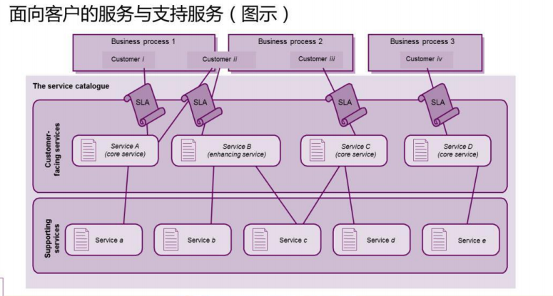
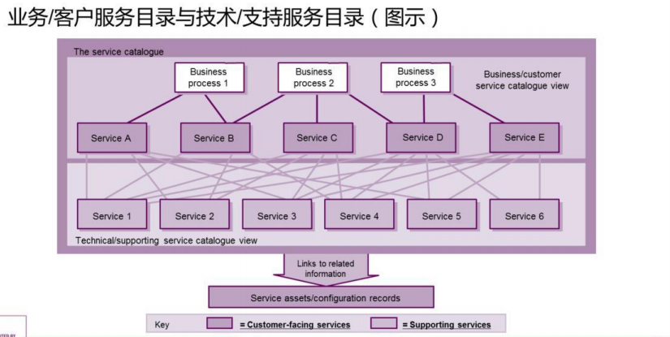
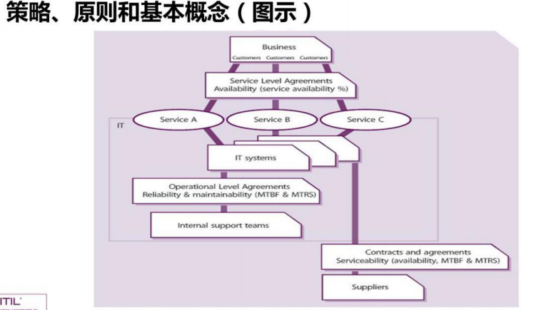
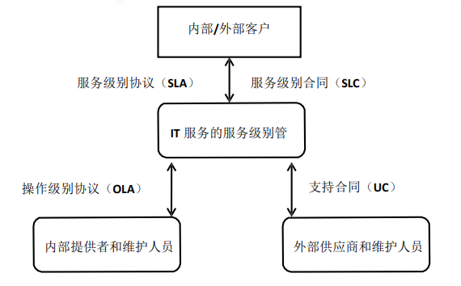
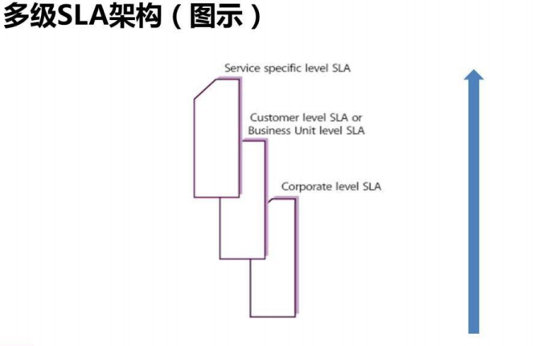
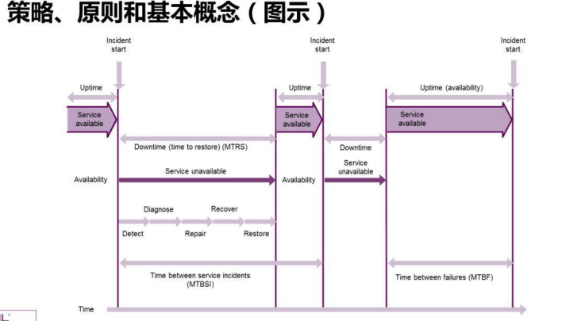
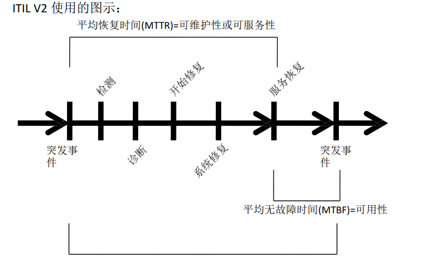
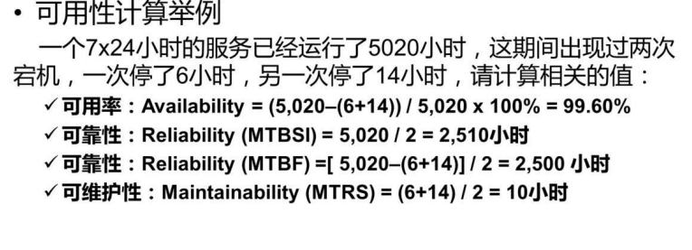

<center><h1>ITIL服务设计</h1></center>  

###1. 服务设计概念
- 服务设计原则  
1.ITIL生命周期服务设计阶段的主要目的是==设计那些需要引入到生产环境中的新的或变更的服务==  
2.==一个服务的退休也属于变更的范畴==，也是必须仔细的设计  
3.该生命周期阶段还负责服务提供商的整套管理系统，以及有效的交付服务所需要的其他方面，如流程、架构、和工具等。  

###2. 服务设计流程
####2.1 设计协调
- 目的  
通过提供和维护一个对服务生命周期中服务设计阶段所有活动和流程的==单一的协调和控制点==，来保证该阶段的目标能够得到满足  

- 目标  
1.在项目、变更、供应商和支持团队之间协调所有的设计活动  
2.为设计新的或变更的服务计划和协调资源和能力  
3.改经服务设计流程的效率(Efficiency)和效力(Effectiveness)  

- 范围  
1.为服务设计活动和流程维护策略、指导、标准、预算、模型、资源和能力  
2.通过协调、确定优先级和妥善安排所有的服务设计资源来==解决多个项目和变更对资源的需求(有冲突)==  
3.检查、度量和改进所有的服务设计活动和流程的绩效  
4.==保证所有的需求在服务设计的过程中都被考虑到，特别是对功用和功效的需求==  
5.==保证服务设计的产品或SDPS的质量，并交接给服务转换==  

- 流程活动、方法和技术  
1.动议和维护策略和方法  
2.计划设计资源和能力  
3.协调设计活动  
4.挂你设计风险和问题  
5.改进服务设计  
6.计划单个的设计  
7.协调单个的设计  
8.监视单个的设计  
9.检查设计并保证服务设计包的交接  

- 主要KPI  
1.==减少后续对SDPs内容的修订数量==  
2.在项目和变更成员中，增加对服务设计活动的满意度  
3.降低由服务设计资源冲突引起的问题的数量  
4.新的或变更的服务按照成果、质量、成本和事件表来衡量，成功的百分比增加  
5.服务设计流程、活动和支持系统的效力和效率得到改进  
6.降低有项目提交的紧急变更的数量和百分比  
7.客户对每一个新的或变更的服务的满意度分数满足或超过设定的等级  
8.转换的服务达到协定的服务级别的百分比增加  

####2.2 服务目录管理
- 目的  
==提供一个v包含所有协定服务的信息来源，并保证这些信息对所有的授权人具有广泛的可用性==  

- 目标  
==1.管理服务目录中的信息，并保证这些信息的准确性==  
2.保证服务目录支持所有其他服务管理流程对服务目录信息演变的需求，包括所有的接口和从属信息  

- 范围  
==1.产生并维护一个准确的服务目录==  
2.服务目录与整个服务组合的接口、以来关系和一致性  
3.所有的服务与支持服务之间的接口和依赖关系  
4.所有的服务与支持的组件之间的接口和依赖关系  

- 策略、原则和基本概念  



- 流程活动、方法和技术  
1.协商并归档服务定义，并藐视每个服务的相关部分  
2.与服务组合管理协商服务组合和服务目录的内容  
3.产生和维护一个准确的服务目录以及它的内容  
4.与业务部门和IT服务连续性管理流程保持联系  
5.做好与支持团队、供应商、服务资产与配置管理流程的接口  
6.做好与业务关系管理和服务级别管理流程的接口  

- 主要KPI  
==1.检测到的服务目录中记录的信息与实际环境中的信息不一致的情况要减少==  
2.业务用户通过企业内部网络访问服务目录的数量要增加  
3.服务台和其他IT人员为支持活的服务而访问服务目录的次数要增加  

####2.3 服务级别管理
- 目的  
保证==目前==所提供的IT服务都能满足协议的级别，==将要==提供的IT服务也能够满足协议的，可达到的目的  

- 目标  
==1提供并改进与业务和客户之间的关系，并与他们保持沟通  
==2.与业务 关系管理流程协同工作==  
3.保证对所有的IT服务都开发了特定的、可度量的目标  
4.监视和改进客户对已交付服务的满意度  

- 范围  
1.与==业务关系管理==流程协调  
2.对当前的和将来的服务级别需求（SLR）和目标进行谈判并达成协议  
3.开发和管理适当的==OLA==，并保证他的目标与==SLA==的目标一致性  
4.与==供应商==一起检查所有的供应商协议和支持合同（==UC==），以保证他们的目标与SLA的目标是一致的  
5.==报告和管理所有的服务级别成就，检查所有的SLA背离==  

- 策略、原则和基本概念  
1.服务级别管理：负责协商服务级别协议，并且保证协议的内容被满足  
2.服务级别协议： 是IT服务提供商与客户签署的一个协议  
3.运营级别协议： 是IT服务提供商与内部其他部门签署的一项协议  
4.支持合同：是IT服务提供商与第三方机构签署的一个合同  
  
  

- SLA架构  
1.sercice-based SLA(基于服务的SLA)  
2.Customer-based SLA(基于客户的SLA)  
3.Multi-level SLAS(多级SLA)  
注意：  
ITIL 中的 SLA 只有两种形式，一种是基于服务的（Service-based），
一种是基于客户的（Customer-based）。多级 SLA（Multi-level）不
是 SLA 的一种形式，而是一种组合。
  

- 流程活动、方法和技术  
1.设计SLA架构  
2.定义归档和协商对新的服务的需求，并产生SLR  
3.对运营的服务谈判、归档和协议SLA  
4.按照SLA来监视服务的绩效  
5.产生服务报告  
6.执行服务检查，并在整体服务改进计划内推动服务改进  
7.收集、度量和改进客户满意度  
8.检查和修改SLA、服务范围和支持协议  
9.检查和修改OLA、支持协议和服务范围  
10.开发业务交往和关系  
11.处理投诉和表扬  

- ITIL V2 SLA生产过程  
1.建立服务目录  
2.期望管理  
3.规划SLA结构  
4.建立SLAs及起草SLA  
5.撰写SLAs  
6.达成协议  
7.建设监控能力  
8.评审UCs和OLAs  
9.定义报告和评审步骤  
10.公布SLAs  

- 主要KPI  
==1.减少SLA目标威胁的百分比==  
2.增加客户对SLA成果的感知和满意度  
3.减少由于第三方支持合同而引起的SLA背离的百分比  
4.减少由于内部OLA而引起的SLA背离的百分比  
5.减少监视和报告SLA的成本  
6.增加开发和协商SLA的速度  
7.服务检查会议的频率  
==8.增加SLA的覆盖百分比==  
9.按时完成SLA的检查百分比  
10.减少每年需要重新谈判的SLA百分比  
11 减少需要v爱去纠正变更措施的SLa的百分比  
注意：  
“SLA 目标威胁”就是亮黄灯的概念，需要你额外定义一下。比如你
在某项服务的 SLA 中承诺的宕机恢复时间为 8 小时，那超过 8 小时
就是 亮红灯。什么时候亮黄灯呢？你可以定义超过 7 小时就亮黄灯。

####2.4 可用性管理
- 目的  
以==符合成本效益==的方法保证所有的服务的可用性级别达到或者超过当前或将来业务的需求  

- 目标  
1.产生和维护一个适当的、最新的可用性计划，它反映当前和未来的业务需求  
2.就所有可用性相关的事情向IT和其他业务区域提供建议和指导  
3.通过管理服务和资源相关的可用性绩效，来保证服务的可用性达到协定的目标  

- 范围  
1.可用性流程管理的范围涉及IT服务和组件可用性设计、实施、度量、管理和改进 
2.可用性管理是一个持续的流程，只有当服务退休之后，他才会结束  
3.可用性管理的两个关键因素： 
被动活动--》包含对所有不可用事件、故障和问题的监视、度量、分析和管理  
主动活动--》包括主动地计划、设计和改进可用性  
4.可用性管理流程包括：  
监视IT服务很支持组件的可用性，可靠性和可维护性  
为所有的可用性度量，指标和维护一套方法、技术和算式  

- 策略、原则和基本概念  
==1.可用性管理的两个级别：服务和组件==  
2.可用率：一个服务，组件或者CI应去执行它的协定职能的能力  
3.可靠性：一个度量标准，说明一个服务，组件或者CI能够执行协议的功能而没有发生中断的时间长度  
4.可维护性：一个度量指标，说明一个服务，组件或者CI在失败后如何能够快速、有效的恢复到正常工作状态的能力  
5.可服务性：第三方供应商满足合同义务的能力  
  
  
  
!!! note 
    ```
    对于可用性计算的这个百分数（99.60%）来说，当然是越大越好。
    那最大能到什么程度呢？有的同学可能会说是 100%。是的，理论上
    是 100%，但实际中的、比较现实的数字是 99.99%。
    对于可靠性（MTBF）这个小时数（2500 小时）来说，也是越大越好
    。
    对于可维护性（MTRS）这个小时数（10 小时）来说，是越短越好。
    ```

- 流程活动、方法和技术  
1.被动活动
    监视、度量、分析、报告和检查服务和组件的可用性  
    调查所有服务和组件不可用的事件，并采取补救措施  
2.主动活动
    计划和设计新的或变更的服务  
    风险评估和分析  
    检查所有的新的或变更的服务，并测试所有的可用性和弹性机制  
    持续的检查和改进  

!!! note
    ```
    被动的活动就是监视和度量，看哪里有服务或组件不可用的情况，然后去处理  
    主动的活动就是在服务的计划和设计阶段就考虑到可用性的事情了，比如说邮件服务对某公司来说非常重要，那该公司的邮件服务在计划和设计的时候就应该考虑高可用，比如采用服务器群集  
    ```

- 主要KPI  
1.对SLA、OLA和UC中与可用性和可靠性相关的问题进行有效的检查和跟进  
==2.整个端到端的服务百分比的改进==  
3.服务不可用的百分比降低  
4.降低由于IT不可用而造成业务部门加班的成本的百分比  
==5.降低关键时间失败的百分比==  
6.改进业务部门和用户对服务满意度的百分比  
7.改进服务交付成本的百分比  
8.及时完成定期的风险评估和系统检查  
9.降低由于第三方问题而引发的服务失败的百分比  
10.减少完成一次风险评估所用的时间  

!!! note
    ```
    “降低关键时间失败的百分比”这个 KPI 很重要，因为在“关键时间 ”服务失败对业务的影响会比较大。所以，关键时间对可靠性、可维护性等指标的要求会更高一些  
    ```

####2.5 容量管理
- 目的  


- 目标  


- 范围  

- 策略、原则和基本概念  


- 流程活动、方法和技术  


- 主要KPI  


####2.6 IT服务连续性管理
- 目的  


- 目标  


- 范围  


- 策略、原则和基本概念  


- 流程活动、方法和技术  


- 主要KPI  


####2.7 信息安全管理
- 目的  


- 目标  


- 范围  

- 策略、原则和基本概念  


- 流程活动、方法和技术  


- 主要KPI  


####2.8 供应商管理
- 目的  


- 目标  


- 范围  

- 策略、原则和基本概念  


- 流程活动、方法和技术  


- 主要KPI  


###3. 其他内容


###4. 挑战、风险和关键成功因素