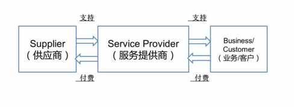
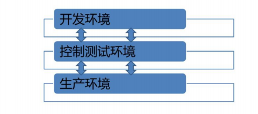
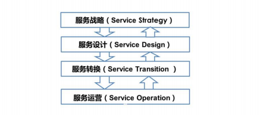

<h1>ITIL总结</h1>
 

###1. 一条主线
主线：==生命周期==  
从ITIL v3开始，开发方把项目管理中常用的生命周期的概念作为ITIL框架的主线，使IT服务管理与IT项目管理的关系更加密切

###2. 两大场景
- ==内部场景==  
单位的IT部门怎么为其他部门（主要i是业务部门）提供IT服务，并把这些服务管理好  

- ==外部场景==  
专门做IT服务的公司怎么为他们的客户提供IT服务，并把这些服务管理好  

注意： ==目前主要还是以内部场景为主==  

###3. 三个部分
供应商--》服务提供商--》业务/客户
  

###4. 三个环境
- 开发环境  
- 控制测试环境  
- 生产环境  
  

###5. 四个阶段 
- 服务战略  
- 服务设计  
- 服务转换  
- 服务运营  

   

###6. 四项职能
- 服务台  
- 技术管理  
- IT运营管理  
- 应用程序管理  

###7. 五个模块 
- 服务战略  
- 服务设计  
- 服务转换  
- 服务运营  
- 持续服务改进  

###8. 六个核心流程
- 服务运营： 事件管理、问题管理  
- 服务转换： 变更管理、配置管理  
- 服务设计： 服务目录管理、服务级别管理

###9. 七步改进
1. 识别改进战略  
2. 定义你将度量什么  
3. 收集数据  
4. 处理数据  
5. 分析信息和数据  
6. 展现和使用信息  
7. 实施改进  

###10. 二十六个流程
####10.1 服务战略（5个）
- IT服务的传略管理
- 服务组合管理
- IT服务财务管理
- 需求管理
-  业务关系管理

####10.2 服务战略（8个）
- 设计协调
- 服务目录管理
- 服务级别管理
- 可用性管理
- 容量管理
- IT服务连续性管理
- 信息安全管理
- 供应商管理

####10.3 服务战略（7个）
- 转换计划和支持
- 变更管理
- 服务资产金额配置管理
- 发布和部署管理
- 服务验证与测试
- 变更评价
- 知识管理

####10.4 服务战略（5个）
- 事态管理
- 事件管理
- 请求履行
- 问题管理
- 访问管理

####10.5 服务战略（1个）
- 七步改进