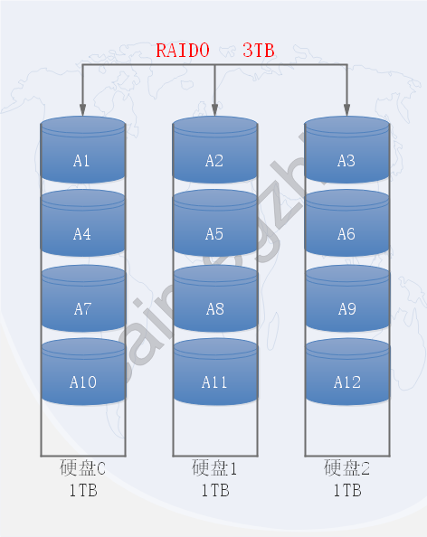
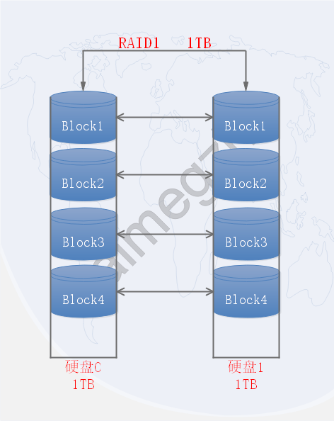
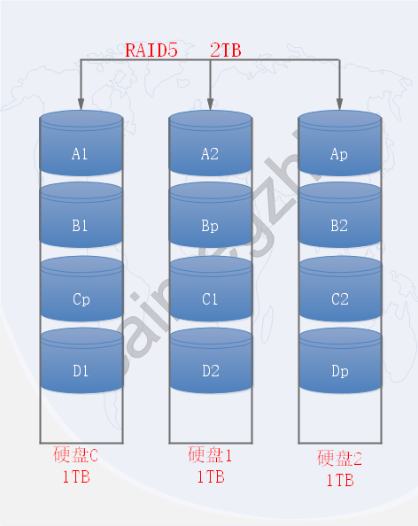
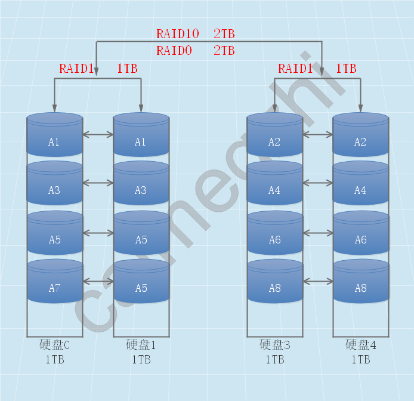

<h1>Raid知识点</h1>

## 1. Raid知识
&#160; &#160; &#160; &#160;磁盘阵列（Redundant Arrays of Independent Disks，RAID），有“独立磁盘构成的具有冗余能力的阵列”之意。

&#160; &#160; &#160; &#160;磁盘阵列是由很多价格较便宜的磁盘，组合成一个容量巨大的磁盘组，利用个别磁盘提供数据所产生加成效果提升整个磁盘系统效能。利用这项技术，将数据切割成许多区段，分别存放在各个硬盘上。

&#160; &#160; &#160; &#160;磁盘阵列还能利用同位检查（Parity Check）的观念，在数组中任意一个硬盘故障时，仍可读出数据，在数据重构时，将数据经计算后重新置入新硬盘中。

### 1.1 基本介绍
&#160; &#160; &#160; &#160;独立磁盘冗余阵列（RAID，redundant array of independent disks）是把相同的数据存储在多个硬盘的不同的地方（因此，冗余地）的方法。通过把数据放在多个硬盘上，输入输出操作能以平衡的方式交叠，改良性能。因为多个硬盘增加了平均故障间隔时间（MTBF），储存冗余数据也增加了容错。

### 1.2 阵列分类
&#160; &#160; &#160; &#160;磁盘阵列其样式有三种，一是外接式磁盘阵列柜、二是内接式磁盘阵列卡，三是利用软件来仿真。

&#160; &#160; &#160; &#160;外接式磁盘阵列柜最常被使用大型服务器上，具可热交换（Hot Swap）的特性，不过这类产品的价格都很贵。

&#160; &#160; &#160; &#160;内接式磁盘阵列卡，因为价格便宜，但需要较高的安装技术，适合技术人员使用操作。硬件阵列能够提供在线扩容、动态修改阵列级别、自动数据恢复、驱动器漫游、超高速缓冲等功能。它能提供性能、数据保护、可靠性、可用性和可管理性的解决方案。阵列卡专用的处理单元来进行操作。

&#160; &#160; &#160; &#160;利用软件仿真的方式，是指通过网络操作系统自身提供的磁盘管理功能将连接的普通SCSI卡上的多块硬盘配置成逻辑盘，组成阵列。软件阵列可以提供数据冗余功能，但是磁盘子系统的性能会有所降低，有的降低幅度还比较大，达30%左右。因此会拖累机器的速度，不适合大数据流量的服务器。

### 1.3 优缺点
#### 1.3.1 优点
&#160; &#160; &#160; &#160;提高传输速率。RAID通过在多个磁盘上同时存储和读取数据来大幅提高存储系统的数据吞吐量（Throughput）。在RAID中，可以让很多磁盘驱动器同时传输数据，而这些磁盘驱动器在逻辑上又是一个磁盘驱动器，所以使用RAID可以达到单个磁盘驱动器几倍、几十倍甚至上百倍的速率。这也是RAID最初想要解决的问题。因为当时CPU的速度增长很快，而磁盘驱动器的数据传输速率无法大幅提高，所以需要有一种方案解决二者之间的矛盾。RAID最后成功了。

&#160; &#160; &#160; &#160;通过数据校验提供容错功能。普通磁盘驱动器无法提供容错功能，如果不包括写在磁盘上的CRC（循环冗余校验）码的话。RAID容错是建立在每个磁盘驱动器的硬件容错功能之上的，所以它提供更高的安全性。在很多RAID模式中都有较为完备的相互校验/恢复的措施，甚至是直接相互的镜像备份，从而大大提高了RAID系统的容错度，提高了系统的稳定冗余性。

#### 1.3.2 缺点
&#160; &#160; &#160; &#160;RAID0没有冗余功能，如果一个磁盘（物理）损坏，则所有的数据都无法使用。

&#160; &#160; &#160; &#160;RAID1磁盘的利用率最高只能达到50%(使用两块盘的情况下)，是所有RAID级别中最低的。

&#160; &#160; &#160; &#160;RAID0+1以理解为是RAID 0和RAID 1的折中方案。RAID 0+1可以为系统提供数据安全保障，但保障程度要比 Mirror低而磁盘空间利用率要比Mirror高。

## 2. Raid种类介绍
以下主要介绍raid0，raid1,raid5，raid10四种介绍。

### 2.1 raid0

&#160; &#160; &#160; &#160;RAID 0是最早出现的RAID模式，即Data Stripping数据分条技术。RAID 0是组建磁盘阵列中最简单的一种形式，只需要2块以上的硬盘即可，成本低，可以提高整个磁盘的性能和吞吐量。RAID 0没有提供冗余或错误修复能力，但实现成本是最低的。

&#160; &#160; &#160; &#160;RAID 0最简单的实现方式就是把N块同样的硬盘用硬件的形式通过智能磁盘控制器或用操作系统中的磁盘驱动程序以软件的方式串联在一起创建一个大的卷集。在使用中电脑数据依次写入到各块硬盘中，它的最大优点就是可以整倍的提高硬盘的容量。如使用了三块80GB的硬盘组建成RAID 0模式，那么磁盘容量就会是240GB。其速度方面，各单独一块硬盘的速度完全相同。最大的缺点在于任何一块硬盘出现故障，整个系统将会受到破坏，可靠性仅为单独一块硬盘的1/N。

&#160; &#160; &#160; &#160;为了解决这一问题，便出现了RAID 0的另一种模式。即在N块硬盘上选择合理的带区来创建带区集。其原理就是将原先顺序写入的数据被分散到所有的四块硬盘中同时进行读写。四块硬盘的并行操作使同一时间内磁盘读写的速度提升了4倍。

&#160; &#160; &#160; &#160;在创建带区集时，合理的选择带区的大小非常重要。如果带区过大，可能一块磁盘上的带区空间就可以满足大部分的I/O操作，使数据的读写仍然只局限在少数的一、两块硬盘上，不能充分的发挥出并行操作的优势。另一方面，如果带区过小，任何I/O指令都可能引发大量的读写操作，占用过多的控制器总线带宽。因此，在创建带区集时，应当根据实际应用的需要，慎重的选择带区的大小。

&#160; &#160; &#160; &#160;带区集虽然可以把数据均匀的分配到所有的磁盘上进行读写。但如果把所有的硬盘都连接到一个控制器上的话，可能会带来潜在的危害。这是因为当频繁进行读写操作时，很容易使控制器或总线的负荷 超载。为了避免出现上述问题，建议用户可以使用多个磁盘控制器。最好解决方法还是为每一块硬盘都配备一个专门的磁盘控制器。

&#160; &#160; &#160; &#160;虽然RAID 0可以提供更多的空间和更好的性能，但是整个系统是非常不可靠的，如果出现故障，无法进行任何补救。所以，RAID 0一般只是在那些对数据安全性要求不高的情况下才被人们使用

- 优点

&#160; &#160; &#160; &#160;1. 读写性能是所有RAID级别中最高的。

&#160; &#160; &#160; &#160;2. RAID0的缺点是不提供数据冗余，因此一旦用户数据损坏，损坏的数据将无法得到恢复。RAID0运行时只要其中任一块硬盘出现问题就会导致整个数据的故障。一般不建议企业用户单独使用。

- 缺点

&#160; &#160; &#160; &#160;1. 磁盘空间使用率：100%，故成本最低。

&#160; &#160; &#160; &#160;2. 读性能：N*单块磁盘的读性能

&#160; &#160; &#160; &#160;3. 写性能：N*单块磁盘的写性能

&#160; &#160; &#160; &#160;4. 冗余：无，任何一块磁盘损坏都将导致数据不可用。

### 2.2 raid1

&#160; &#160; &#160; &#160;RAID 1称为磁盘镜像，原理是把一个磁盘的数据镜像到另一个磁盘上，也就是说数据在写入一块磁盘的同时，会在另一块闲置的磁盘上生成镜像文件，在不影响性能情况下最大限度的保证系统的可靠性和可修复性上，只要系统中任何一对镜像盘中至少有一块磁盘可以使用，甚至可以在一半数量的硬盘出现问题时系统都可以正常运行,当一块硬盘失效时，系统会忽略该硬盘，转而使用剩余的镜像盘读写数据，具备很好的磁盘冗余能力。虽然这样对数据来讲绝对安全，但是成本也会明显增加，磁盘利用率为50%，以四块80GB容量的硬盘来讲，可利用的磁盘空间仅为160GB。另外，出现硬盘故障的RAID系统不再可靠，应当及时的更换损坏的硬盘，否则剩余的镜像盘也出现问题，那么整个系统就会崩溃。更换新盘后原有数据会需要很长时间同步镜像，外界对数据的访问不会受到影响，只是这时整个系统的性能有所下降。因此，RAID 1多用在保存关键性的重要数据的场合。

&#160; &#160; &#160; &#160;RAID 1主要是通过二次读写实现磁盘镜像，所以磁盘控制器的负载也相当大，尤其是在需要频繁写入数据的环境中。为了避免出现性能瓶颈，使用多个磁盘控制器就显得很有必要。

- 优点

&#160; &#160; &#160; &#160;RAID1通过硬盘数据镜像实现数据的冗余，保护数据安全，在两块盘上产生互为备份的数据，当原始数据繁忙时，可直接从镜像备份中读取数据，因此RAID1可以提供读取性能。
RAID1是硬盘中单位成本最高的，但提供了很高的数据安全性和可用性，当一个硬盘失效时，系统可以自动切换到镜像硬盘上读/写，并且不需要重组失效的数据。

- 缺点

&#160; &#160; &#160; &#160;1. 磁盘空间使用率：50%，故成本最高。

&#160; &#160; &#160; &#160;2. 读性能：只能在一个磁盘上读取，取决于磁盘中较快的那块盘

&#160; &#160; &#160; &#160;3. 写性能：两块磁盘都要写入，虽然是并行写入，但因为要比对，故性能单块磁盘慢。

&#160; &#160; &#160; &#160;4. 冗余：只要系统中任何一对镜像盘中有一块磁盘可以使用，甚至可以在一半数量的硬盘出现问题时系统都可以正常运行。

### 2.3 raid5

&#160; &#160; &#160; &#160;从上图可以看到，它的奇偶校验码存在于所有磁盘上，其中的p[a,b,c..]代表第a带区的奇偶校验值，其它的意思也相同。RAID5的读出效率很高，写入效率一般，块式的集体访问效率不错。因为奇偶校验码在不同的磁盘上，所以提高了可靠性。但是它对数据传输的并行性解决不好，而且控制器的设计也相当困难。RAID 3 与RAID 5相比，重要的区别在于RAID 3每进行一次数据传输，需涉及到所有的阵列盘。而对于RAID 5来说，大部分数据传输只对一块磁盘操作，可进行并行操作。在RAID 5中有“写损失”，即每一次写操作，将产生四个实际的读/写操作，其中两次读旧的数据及奇偶信息，两次写新的数据及奇偶信息。

- 总结

&#160; &#160; &#160; &#160;1. 磁盘空间利用率：(N-1)/N，即只浪费一块磁盘用于奇偶校验。

&#160; &#160; &#160; &#160;2. 读性能：(n-1)*单块磁盘的读性能，接近RAID0的读性能。

&#160; &#160; &#160; &#160;3. 写性能：比单块磁盘的写性能要差

&#160; &#160; &#160; &#160;4. 冗余：只允许一块磁盘损坏。

### 2.4 raid10

&#160; &#160; &#160; &#160;这种结构无非是一个带区结构加一个镜象结构，因为两种结构各有优缺点，因此可以相互补充，达到既高效又高速的目的。大家可以结合两种结构的优点和缺点来理解这种新结构。这种新结构的价格高，可扩充性不好。主要用于数据容量不大，但要求速度和差错控制的数据库中。

- 总结

&#160; &#160; &#160; &#160;1. 磁盘空间利用率：50%。

&#160; &#160; &#160; &#160;2. 读性能：N/2*单块硬盘的读性能

&#160; &#160; &#160; &#160;3. 写性能：N/2*单块硬盘的写性能

&#160; &#160; &#160; &#160;4. 冗余：只要一对镜像盘中有一块磁盘可以使用就没问题。

