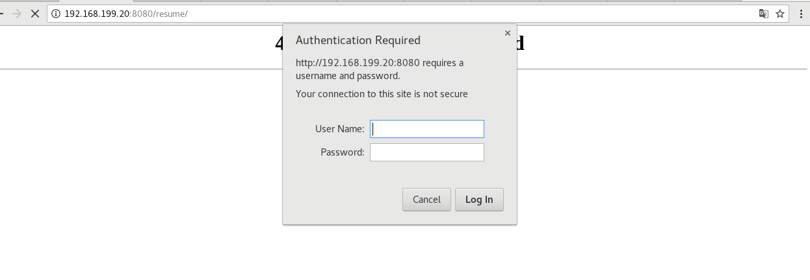

<center><h1>Nginx密码认证</h></center>  

### 1.应用场景
场景1.一些非公开的页面，只想给特定的用户访问，但是又不想写权限控制
场景2.临时需要请求线上的调试接口，但是这些接口不能直接暴露nginx启用密码认证

###2. 环境
|名称|版本|  
|:-:|:-:|  
系统|CentOS Linux release 7.6.1810 (Core) |  
Nginx|1.12.2  |  
server ip|192.168.199.20 |  


###3.安装配置
```shell
#1.安装生成账号密码工具
yum install -y httpd-tools

#2.创建一个个密码文件
#语法：htpasswd -bc 生成账号密码文件路径 账号名 密码
mkdir /etc/nginx/key
htpasswd -bc /etc/nginx/key/passwd.db admin "admin!@#"

#3.在nginx配置启用密码认证
        location / {
            root    /usr/share/nginx/html;
            index   index.html;
            auth_basic "input password";
            auth_basic_user_file "/etc/nginx/key/passwd.db";
        }

#4.检查配置文件是否合规
nginx -t

#5.重新加载配置文件
systemctl reload nginx
```

###4.效果如下

