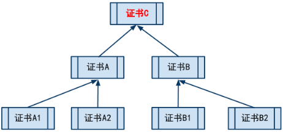

#####先来一个例子
```
A公司的小明被派到B公司办事情。B公司如何信任小明是A公司派来的呢？
```
######普通介绍信
```
为了让B公司信任小明，A公司特意给小明开了一封介绍信，在信件中详细说明了小明的特征以及小明过来的目的，
并且声明这个小明确实是A公司派来的，除此之外还要有一个A公司的公章。
这样B公司前台小姐姐拿到介绍信后，通过信件内容和A公司公章就能判断出小明确实是A公司派来的员工。 

那万一A公司公章是假的呢？毕竟公章伪造太容易了，这样岂不是会存在问题。咱们就暂且认为公章这种东西很难伪造，
否则故事无法继续喽。
```
######引入第三方中介公司
```
好，回到刚才的话题。如果和B公司有业务往来的公司很多，每个公司的公章都不同，那B公司的前台小姐姐就要懂得分辨各种公章，
非常滴麻烦。所以，有某个中介公司C，发现了这个商机。C公司专门开设了一项“代理公章”的业务。
　　
于是今后，A公司的业务员去B公司，需要带2个介绍信：
介绍信1（含有C公司的公章及A公司的公章。并且特地注明：C公司信任A公司。）
介绍信2（仅含有A公司的公章，然后写上：兹有xxx先生/女士前往贵公司办理业务，请给予接洽......。）

这样不是增加麻烦了吗？有啥好处呢？
主要的好处在于，对于接待公司的前台，就不需要记住各个公司的公章分别是啥样子的，她只要记住中介公司C的公章即可。
当她拿到两份介绍信之后，先对介绍信1的C公章验明正身，确认无误之后，再比对“介绍信1”和“介绍信2”的两个A公章是否一致。
如果是一样的，那就可以证明“介绍信2”是可以信任的了。
```
#####相关专业术语的解释
```
下面就着上面的例子，把相关的名词，作一些解释。
```
######什么是证书？
```
证书，洋文也叫“digital certificate”或“public key certificate”。
它是用来证明某某东西确实是某某的东西，通俗地说，证书就好比例子里面的公章。通过公章，
可以证明该介绍信确实是对应的公司发出的。
理论上，人人都可以找个证书工具，自己做一个证书。那如何防止坏人自己制作证书出来骗人呢？
```
######什么是CA？
```
CA 是“Certificate Authority”的缩写，也叫“证书授权中心”。它是负责管理和签发证书的第三方机构，
就好比例子里面的中介C公司。
一般来说，CA必须是所有行业和所有公众都信任的、认可的。因此它必须具有足够的权威性。
就好比A、B两公司都必须信任C公司，才会找C公司作为公章的中介。
```
######什么是CA证书？
```
CA证书，顾名思义，就是CA颁发的证书。

前面已经说了，人人都可以找工具制作证书。但是你一个小破孩制作出来的证书是没啥用处的。
因为你不是权威的CA机关，你自己搞的证书不具有权威性。
这就好比上述的例子里，某个坏人自己刻了一个公章，盖到介绍信上。但是别人一看，
不是受信任的中介公司的公章，就不予理睬。
```
######什么是证书之间的信任关系？
```
在开篇的例子里谈到，引入中介后，业务员要同时带两个介绍信。第一个介绍信包含了两个公章，并注明，公章C信任公章A。
证书间的信任关系，就和这个类似。就是用一个证书来证明另一个证书是真实可信滴。
```

######什么是证书信任链？
```
实际上，证书之间的信任关系，是可以嵌套的。
比如，C信任A1，A1信任A2，A2信任A3......这个叫做证书的信任链。
只要你信任链上的头一个证书，那后续的证书，都是可以信任滴。
```

######什么是根证书？
```
根证书的洋文叫“root certificate”，为了说清楚根证书是咋回事，再来看个稍微复杂点的例子。
假设C证书信任A和B；然后A信任A1和A2；B信任B1和B2。则它们之间，构成如下的一个树形关系（一个倒立的树）。
```

```
处于最顶上的树根位置的那个证书，就是“根证书”。除了根证书，其它证书都要依靠上一级的证书，来证明自己。
那谁来证明“根证书”可靠呢？
实际上，根证书自己证明自己是可靠滴（或者换句话说，根证书是不需要被证明滴）。
聪明的同学此刻应该意识到了：根证书是整个证书体系安全的根本。
所以，如果某个证书体系中，根证书出了问题（不再可信了），那么所有被根证书所信任的其它证书，也就不再可信了。
```

#####证书有啥用？

CA证书的作用有很多，只列出常用的几个。

* 验证网站是否可信（针对HTTPS）
```
通常，我们如果访问某些敏感的网页（比如用户登录的页面），其协议都会使用HTTPS而不是HTTP,因为HTTP协议是明文的，
一旦有坏人在偷窥你的网络通讯，他/她就可以看到网络通讯的内容（比如你的密码、银行帐号、等）。
而 HTTPS 是加密的协议，可以保证你的传输过程中，坏蛋无法偷窥。
但是，千万不要以为，HTTPS协议有了加密，就可高枕无忧了。
假设有一个坏人，搞了一个假的网银的站点，然后诱骗你上这个站点。
假设你又比较单纯，一不留神，就把你的帐号，口令都输入进去了。那这个坏蛋的阴谋就得逞了。
为了防止坏人这么干，HTTPS 协议除了有加密的机制，还有一套证书的机制。通过证书来确保，某个站点确实就是某个站点。
有了证书之后，当你的浏览器在访问某个HTTPS网站时，会验证该站点上的CA证书（类似于验证介绍信的公章）。
如果浏览器发现该证书没有问题（证书被某个根证书信任、证书上绑定的域名和该网站的域名一致、证书没有过期），
那么页面就直接打开，否则的话，浏览器会给出一个警告，告诉你该网站的证书存在某某问题，是否继续访问该站点。
```
* 验证文件是否可信

本文参考于  https://program-think.blogspot.com/2010/02/introduce-digital-certificate-and-ca.html