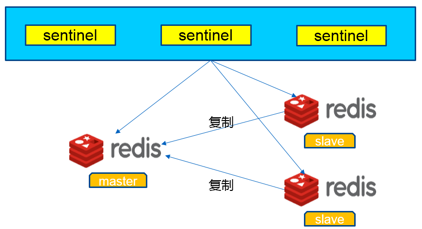
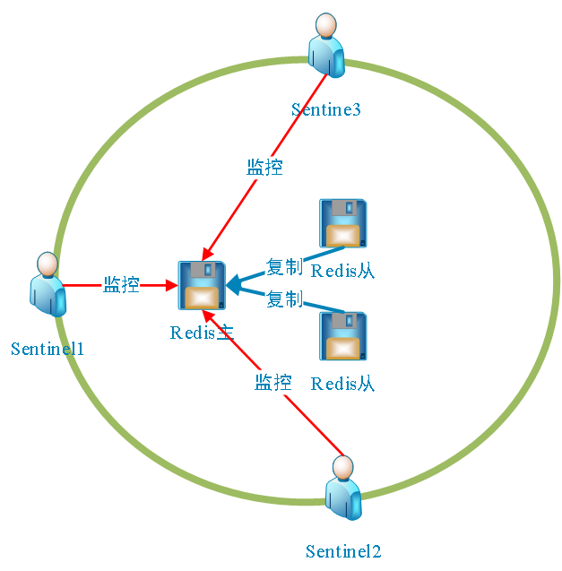
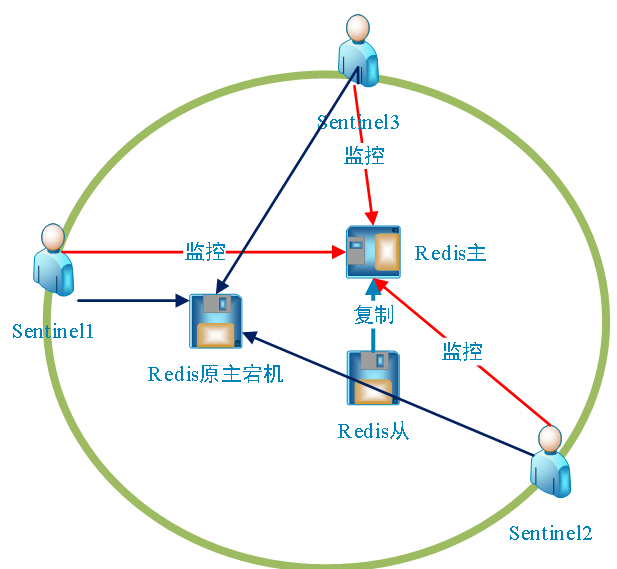

<center><h1>Redis Sentinel</h1></center>

## 1. 介绍
&#160; &#160; &#160; &#160;REmote DIctionary Server(Redis) 是一个由Salvatore Sanfilippo写的key-value存储系统。Redis是一个开源的使用ANSI C语言编写、遵守BSD协议、支持网络、可基于内存亦可持久化的日志型、Key-Value数据库，并提供多种语言的API。它通常被称为数据结构服务器，因为值（value）可以是 字符串(String), 哈希(Map), 列表(list), 集合(sets) 和 有序集合(sorted sets)等类型。Redis 是完全开源免费的，遵守BSD协议，是一个高性能的key-value数据库。Redis 与其他 key - value 缓存产品有以下三个特点：

- Redis支持数据的持久化，可以将内存中的数据保持在磁盘中，重启的时候可以再次加载进行使用。
- Redis不仅仅支持简单的key-value类型的数据，同时还提供list，set，zset，hash等数据结构的存储。
- Redis支持数据的备份，即master-slave模式的数据备份。

### 1.1 优势
- 性能极高 – Redis能读的速度是110000次/s,写的速度是81000次/s 。
- 丰富的数据类型–Redis支持二进制案例的 Strings, Lists, Hashes, Sets 及 Ordered Sets 数据类型操作。
- 原子 – Redis的所有操作都是原子性的，同时Redis还支持对几个操作全并后的原子性执行。
- 丰富的特性 – Redis还支持 publish/subscribe, 通知, key 过期等等特性。

### 1.2 比较
&#160; &#160; &#160; &#160;Redis与其他key-value存储有什么不同
- Redis有着更为复杂的数据结构并且提供对他们的原子性操作，这是一个不同于其他数据库的进化路径。Redis的数据类型都是基于基本数据结构的同时对程序员透明，无需进行额外的抽象。
- Redis运行在内存中但是可以持久化到磁盘，所以在对不同数据集进行高速读写时需要权衡内存，应为数据量不能大于硬件内存。在内存数据库方面的另一个优点是， 相比在磁盘上相同的复杂的数据结构，在内存中操作起来非常简单，这样Redis可以做很多内部复杂性很强的事情。 同时，在磁盘格式方面他们是紧凑的以追加的方式产生的，因为他们并不需要进行随机访问。

## 2. redis sentinel 介绍
### 2.1 Sentinel是什么
&#160; &#160; &#160; &#160;用于监视master是否正常在线，若果说master挂掉了，Sentinel会让其中一个slave顶上去。

### 2.2 开多少个Sentinel合适
&#160; &#160; &#160; &#160;开3个Sentinel，或者说开奇数个，Sentinel的原理就是一直监视着master是否在线，如果是挂掉，Sentinel的集群追选举其中一个领头Sentinel，然后由于领头的Sentinel执行slaveof命令让slave作为master，然后Sentinel集群机选监视新的master，老的master还是会一直监视着如果启动了那么老的master会做为新的master的slave

### 2.3 Sentinel判断master下线的两种标准
- 主观下线  

&#160; &#160; &#160; &#160; Sentinel发现master没有在指定时间返回信息，这种情况呗认为主观下线。[指定时间：这个时间是设置的]

- 客观下线

&#160; &#160; &#160; &#160; sentinel询问Sentinel集群，篮下其他的Sentinel是否也标记这个master是否下线如果标记Sentinel下线的个数达到一个阈值，Sentinel会将master标记为主观下线，这时候会选取领头的Sentinel，由Sentinel选取master下面的一个slave去作为新的master。

## 3. 准备
### 3.1 条件
&#160; &#160; &#160; &#160; 实验环境: 1主两从，3个Sentinel

### 3.2 配置
&#160; &#160; &#160; &#160; 设置Sentinel四个条件:

- IP
- 下线阀值
- slave个数
- 恢复时长

#### 3.2.1 ip地址

&#160; &#160; &#160; &#160; 你要监视主服务器的ip地址，以及设置Sentinel标记客观下线的阈值

!!! note 
    ```python
    sentinel monitor <被监控的名字也就是run_id> <ip> <port> <团体号>	
	sentinel monitor mymaster 127.0.0.1 6379 2
    ```
#### 3.2.2 下线阀值

!!! note 
    ```python
    Sentinel认为主观下线的一个阈值
    sentinel down-after-milliseconds mymaster 30000
    ```
#### 3.2.3 slave个数

!!! note 
    ```python
    故障恢复期间可以同时slave的个数
	sentinel parallel-syncs mymaster 1
    ```
    
#### 3.2.3 恢复时长

!!! note 
    ```python
    故障恢复允许的最大时长
	sentinel failover-timeout mymaster 180000  
    ```
    
## 4. redis sentinel
### 4.1 环境准备
&#160; &#160; &#160; &#160; 采用同一网络内的三台docker主机（可以是物理主机、虚拟机或docker容器），要求三台主机之间都能相互访问，每一台主机上都安装redis-server、redis-sentinel。redis-server负责提供Redis缓存服务，三台主机间的关系是master-slave-slave,redis-sentinel负责提供Redis高可用，VIP始终在redis-server master上，保证对上层应用可写可读。三台主机的冗余度是1，也就是说当有一台主机宕机时另外两台中至少有一台主机可以提供Redis缓存服务。



如图所示，有三台主机，分别标识为Redis1、Redis2、Redis3，它们的角色和配置等信息如下：

主机标识 | IP地址 | 预设角色 
---|---|---
172.17.0.6| redis-server redis-sentinel | vip
172.17.0.14| redis-server redis-sentinel 
172.17.0.16| redis-server redis-sentinel 

&#160; &#160; &#160; &#160; Redis主从系统，除了做数据冗余，开可以做高可用性灾备。Reids提供了Sentinel工具来监控各Master的状态，如果Master异常，则会做主从切换，将slave作为master，将master作为slave。主从切换之后，master_redis.conf、slave_redis.conf和sentinel.conf的内容都会发生改变。master_redis.conf中会多了一句slaveof的配置，sentinel.conf的监控目标也随之调换，这一点要注意。

### 4.2 操作流程
&#160; &#160; &#160; &#160; 整体流程如下几个步骤，以下我使用docker安装，宿主机类似。
- 启动三台ubuntu12.04 64位镜像作为docker容器
- 安装依赖包
- 安装tcl8.6.1
- 安装redis3.0.2
- 配置redis一主两从模式
- 测试redis一主两从
- 配置sentinel监控
- 测试sentinel监控模式
- 启动redis程序
- 启动sentinel监控程序
- 测试及排错

### 4.3 拓扑演变
#### 4.3.1 开始模式



&#160; &#160; &#160; &#160; 开始的三个sentinel监控一个redis的主。当redis主宕机以后，架构图又变了模式。

#### 4.3.2 master宕机
&#160; &#160; &#160; &#160; Master redis宕机后，新主启动，在master redis在指定时间没有响应，三个sentinel仲裁有两人认为下线此时仲裁处新主redis，启动新的master redis后，sentinel同时监控老的master redis。



#### 4.3.3 master修复后
&#160; &#160; &#160; &#160; 当原来的master redis恢复后，此时原来的主就自动变成从去自动同步新的主，架构模式恢复成以下。


### 4.4 启动镜像
启动镜像
```
root@leco:~# docker run -itd --privileged -p 36379:6379 -p 36380:26379 -v /usr/local/src/ sentienl1  bash 
root@leco:~# docker run -itd --privileged -p 36381:6379 -p 36382:26379 -v /usr/local/src/ sentienl2  bash 
root@leco:~# docker run -itd --privileged -p 36383:6379 -p 36384:26379 -v /usr/local/src/ sentienl3  bash  
```

??? note 参数解释
    ```python
    此时端口映射出redis的端口6379和sentinel的端口26379到宿主机。
    --privileged 是获取至高无上的root权限。 
    -v是数据卷管理。
    -d是后台方式运行，为了在容器内exit后容器不退出。
    ```

### 4.5 安装
#### 4.5.1 依赖
```
root@8d7240ab9c47:~# apt-get install iputils-ping
root@8d7240ab9c47:~# apt-get install -y vim
root@8d7240ab9c47:~# apt-get install -y arping
root@8d7240ab9c47:~# apt-get install -y net-tools
root@8d7240ab9c47:~# apt-get install -y gcc 
root@8d7240ab9c47:~# apt-get install -y make
```
??? note "注意"
    ```python
    我只列出安装了其中一个docker里面的依赖包其他两docker安装一样。目的是利于测试，最后可以卸载在制作成新的镜像时候。
    ```

#### 4.5.2 安装tcl 包    
```
root@8d7240ab9c47:~# tar xzvf tcl8.6.1-src.tar.gz  -C /usr/local/
root@8d7240ab9c47:~# cd /usr/local/tcl8.6.1/unix
root@8d7240ab9c47:~# ./configure
root@8d7240ab9c47:~# make
root@8d7240ab9c47:~# make install
```

#### 4.5.3 安装redis

```
root@8d7240ab9c47:~# tar xvfz redis-3.0.2.tar.gz
root@8d7240ab9c47:~# cd redis-3.0.2
root@8d7240ab9c47:~# make
root@8d7240ab9c47:~# cd src
root@8d7240ab9c47:~# make install 
root@8d7240ab9c47:~# make PREFIX=/usr/local/redis install 
root@8d7240ab9c47:~# useradd -s /sbin/nologin redis
root@8d7240ab9c47:~# mkdir /usr/local/redis/var
root@8d7240ab9c47:~# chmod 777 /usr/local/redis/var/
root@8d7240ab9c47:~# mkdir -p /usr/local/redis/etc           #放置配置文件地方
```

??? info "注意"
    ```python
    我只列出安装了其中一个docker里面的redis,tcl，此时先做为主，其他两从redis docker安装一样。
    ```

### 4.6 配置主从
#### 4.6.1 主从配置
- Master redis.conf配置文件修改

```
root@8d7240ab9c47:~# cat /usr/local/redis/etc/redis.conf
daemonize yes                             # 后台运行
pidfile "/usr/local/redis/var/redis.pid"  # 运行pid文件
port 6379                                 # 端口
timeout 300                               # 超时
loglevel debug                            # debug模式
logfile "/usr/local/redis/var/redis.log"  # 日志文件
databases 16
save 900 1
save 300 10
save 60 10000
rdbcompression yes
dbfilename "dump.rdb"
dir "/usr/local/redis/var"
appendonly no
appendfsync always
bind 0.0.0.0                              # 方式ip限制
```

- Slave1  redis.conf配置文件修改

```
root@38b072848ccd:/# cat /usr/local/redis/etc/redis.conf
daemonize yes
pidfile "/usr/local/redis/var/redis.pid"
port 6379
timeout 300
loglevel debug
logfile "/usr/local/redis/var/redis.log"
databases 16
save 900 1
save 300 10
save 60 10000
rdbcompression yes
dbfilename "dump.rdb"
dir "/usr/local/redis/var"
appendonly no
appendfsync always
bind 0.0.0.0
slaveof 172.17.0.2 6379                  # master ip
```

- Slave2  redis.conf配置文件修改

```
root@56c0344c59a0:/# cat /usr/local/redis/etc/redis.conf
daemonize yes
pidfile "/usr/local/redis/var/redis.pid"
port 6379
timeout 300
loglevel debug
logfile "/usr/local/redis/var/redis.log"
databases 16
save 900 1
save 300 10
save 60 10000
rdbcompression yes
dbfilename "dump.rdb"
dir "/usr/local/redis/var"
appendonly no
appendfsync always
bind 0.0.0.0
slaveof 172.17.0.2 6379
```

??? note "特别注意"
    ```python
        一定要修这个为0.0.0.0 否则宿主机连接不到docker容器里面的redis
    ```

- 启动脚本

```
[root@linux-node2 init.d]# cat /etc/init.d/redis 
#!/bin/sh
#
# Simple Redis init.d script conceived to work on Linux systems
# as it does use of the /proc filesystem.
# chkconfig:   2345 90 10
# description:  Redis is a persistent key-value database
#

REDISPORT=6379
EXEC=/usr/local/bin/redis-server
CLIEXEC=/usr/local/bin/redis-cli

PIDFILE=/var/run/redis_${REDISPORT}.pid
#CONF="/etc/redis/${REDISPORT}.conf"
CONF="/usr/local/redis/etc/redis.conf"

case "$1" in
    start)
        if [ -f $PIDFILE ]
        then
                echo "$PIDFILE exists, process is already running or crashed"
        else
                echo "Starting Redis server..."
                $EXEC $CONF
                echo $(ps aux|grep redis|grep -v grep|grep 6379|awk '{print $2}')>$PIDFILE
        fi
        ;;
    stop)
        if [ ! -f $PIDFILE ]
        then
                echo "$PIDFILE does not exist, process is not running"
        else
                PID=$(cat $PIDFILE)
                echo "Stopping ..."
                $CLIEXEC -p $REDISPORT shutdown
                while [ -x /proc/${PID} ]
                do
                    echo "Waiting for Redis to shutdown ..."
                    sleep 1
                done
                echo "Redis stopped"
                cd /var/run/ && rm -f redis_${REDISPORT}.pid
        fi
        ;;
    *)
        echo "Please use start or stop as first argument"
        ;;
esac
[root@linux-node2 init.d]# chmod +x /etc/init.d/redis 
```

### 4.7 启动
#### 4.7.1 启动 

```
#root@8d7240ab9c47:~# redis-server /usr/local/redis/etc/redis.conf
root@8d7240ab9c47:~#  /etc/init.d/redis start
Starting Redis server...
```
#### 4.7.2 停止

```
#root@8d7240ab9c47:~# redis-cli shutdown
root@8d7240ab9c47:~#  /etc/init.d/redis stop
```

??? note "注意"
    ```python
     其他两个从redis启动方式一样。
    ```

### 4.8 测试主从
&#160; &#160; &#160; &#160;保证三台redis都启动后，查看

```
127.0.0.1:6379> info
。。。。。。
# Replication
role:master
connected_slaves:2
slave0:ip=172.17.0.6,port=6379,state=online,offset=10912,lag=0
slave1:ip=172.17.0.4,port=6379,state=online,offset=10912,lag=0
。。。。。。
```
每个redis都会有该info，可看出其中每个redis的身份role。其中master可以看出它的两个slave情况。

#### 4.8.1 主上设置一个键值对

```
127.0.0.1:6379> set realcloud 1234
OK
127.0.0.1:6379> get realcloud
"1234"
```

#### 4.8.2 Redis slave1查看

```
127.0.0.1:6379> get realcloud
"1234"
```

#### 4.8.2 Redis slave2查看

```
127.0.0.1:6379> get realcloud
"1234"
```
从上可以看出redis一主两从，安装，测试OK。

### 4.8 配置sentinel
&#160; &#160; &#160; &#160;三台机器的配置文件都一样。
#### 4.8.1 配置sentinel
```
root@8d7240ab9c47:~# cat /usr/local/redis/etc/sentinel.conf
port 26379
dir /usr/local/redis/var_sentinel
sentinel monitor mymaster 172.17.0.2 6379 2        #该IP是redis主的IP。根据情况改写。
sentinel down-after-milliseconds mymaster 10000
sentinel parallel-syncs mymaster 1
sentinel failover-timeout mymaster 60000
#sentinel client-reconfig-script mymaster /script/failover.sh
```

#### 4.8.2 启动 sentinel

```
root@8d7240ab9c47:~#mkdir /usr/local/redis/var_sentinel
root@8d7240ab9c47:~# 
redis-sentinel  /usr/local/redis/etc/sentinel.conf >/usr/local/redis/var_sentinel/sentinel.log & 
```

#### 4.8.3 查看
&#160; &#160; &#160; &#160;在主redis上进入sentinel。
 
```
root@8d7240ab9c47:~# redis-cli -p 26379
127.0.0.1:26379>  sentinel master mymaster
 1) "name"
 2) "mymaster"
 3) "ip"
 4) "172.17.0.2"
 5) "port"
 6) "6379"
 7) "runid"
 8) "eb05e2906f6e3f916fbca5f3f3e421560f2bbf21"
 9) "flags"
10) "master"
11) "pending-commands"
12) "0"
13) "last-ping-sent"
14) "0"
15) "last-ok-ping-reply"
16) "451"
17) "last-ping-reply"
18) "451"
19) "down-after-milliseconds"
20) "10000"
21) "info-refresh"
22) "3492"
23) "role-reported"
24) "master"
25) "role-reported-time"
26) "5854962"
27) "config-epoch"
28) "0"
29) "num-slaves"
30) "2"
31) "num-other-sentinels"
32) "2"
33) "quorum"
34) "2"
35) "failover-timeout"
36) "60000"
37) "parallel-syncs"
38) "1"
127.0.0.1:26379>
```

??? note "注意"
    ```python
    redis的默认端口是6379
    redis-sentinel 默认端口是26379
    ```
    
### 4.9 故障模拟
#### 4.9.1 master宕机

```
root@8d7240ab9c47:~# redis-cli shutdown #主宕机
```

#### 4.9.2 查看redis主从情况

```
root@38b072848ccd:~# redis-cli info #此时为master
root@56c0344c59a0:~# redis-cli info
```

#### 4.9.3 查看sentinel情况

```
root@38b072848ccd:~# redis-cli -p 26379
127.0.0.1:26379>  sentinel master mymaster
 1) "name"
 2) "mymaster"
 3) "ip"
 4) "172.17.0.4"
 5) "port"
 6) "6379"
```

&#160; &#160; &#160; &#160;此时在kill当前的master。Sentinel在指定时间内又众筹出当前新的master。当之前的master 又启动好以后sentinel又主动将之前的master添加到新的master中，作为slave。目前为止redis的sentinel测试OK。

