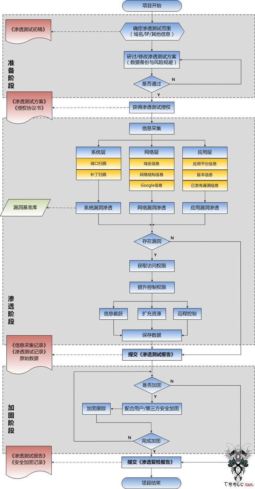
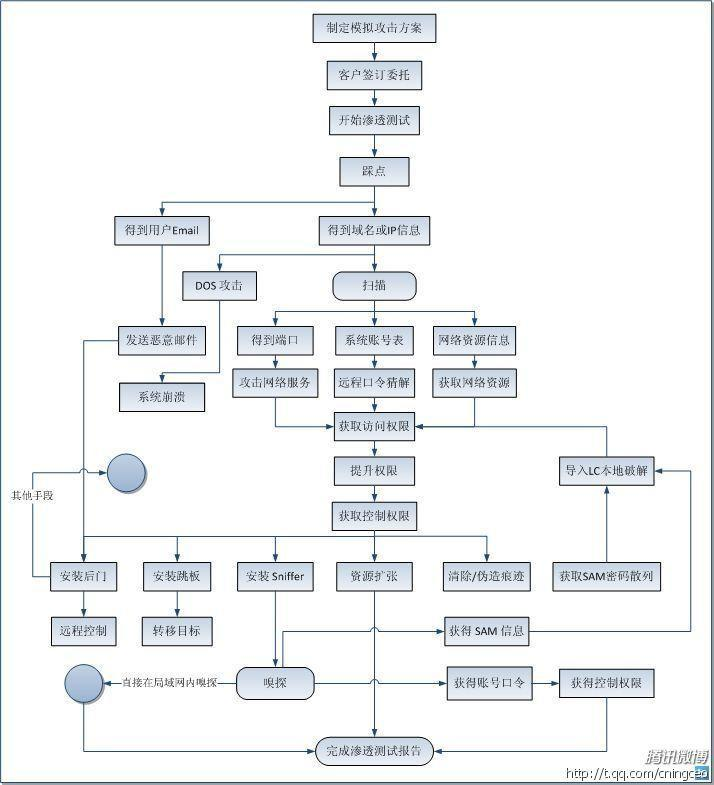

##1.渗透流程
###1.1. 什么是渗透：
模拟黑客，找到企业中的漏洞，给企业相关建议

###1.2. 常规渗透：
1.得到授权的渗透工作，
2.签订保密协议
3.针对性目标测试，
4.指定范围测试

###1.3. 非常规渗透：
1.未得到授权的渗透工作
2.没有指定范围测试
3.没有目标
例如：APT攻击；红蓝对抗

###1.4. 渗透测试流程：
####1.4.1 第一部分：获取授权
1.获取授权
2.获取测试环境，如网段等，防止业务中断
3.签订授权书，保密协议等

####1.4.2 第二部分：初步渗透
1.获取信息：系统层，网络层 ，应用层 
2.获取漏洞，进一步沟通，是否继续
3.1，2完成后进一步深入测试

####1.4.3 第三部分：深入渗透
1.报告前两步情况，确定下一步动作。
2.如果企业同意，则进一步测试
3.编写漏洞报告及加固的方法
4.提交渗透报告
####1.4.4 渗透流程图

####1.4.5 攻击流程图

