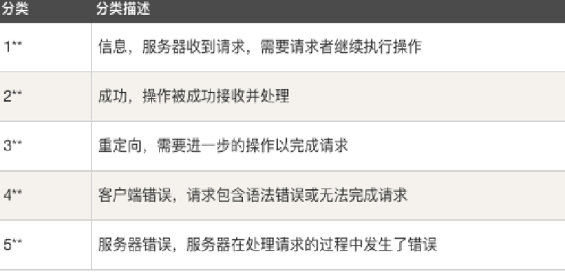

##1. HTTP协议
###1.1 HTTP：
HTTP即超文本传输协议，是一种详细规定了浏览器和万维网服务器之间互相通信的规则，它是万维网交换信息的基础。

###1.2 HTTP请求方法
GET, POST ，HEAD OPTIONS, PUT, DELETE, TRACE ，CONNECT 


###1.3 HTTP状态码



###1.4 HTTP消息


##2.常用命令：
###2.1 curl 
```
# -I 参数可以获取 详细的请求信息
[C:\~]$ curl www.baidu.com -I
  % Total    % Received % Xferd  Average Speed   Time    Time     Time  Current
                                 Dload  Upload   Total   Spent    Left  Speed
  0   277    0     0    0     0      0      0 --:--:-- --:--:-- --:--:--     0
HTTP/1.1 200 OK
Server: bfe/1.0.8.18
Date: Mon, 06 May 2019 14:49:57 GMT
Content-Type: text/html
Content-Length: 277
Last-Modified: Mon, 13 Jun 2016 02:50:08 GMT
Connection: Keep-Alive
ETag: "575e1f60-115"
Cache-Control: private, no-cache, no-store, proxy-revalidate, no-transform
Pragma: no-cache
Accept-Ranges: bytes
```
###2.2 telnet
```
#连接百度 80端口
telnet www.baidu.com 80
#GET 请求，获取信息
GET / HTTP/1.1
```


##3. 参考书籍：
http://www.runoob.com/http/http-status-codes.html  
https://www.telerik.com/fiddler  
https://itbilu.com/other/relate/EJ3fKUwUx.html  
图解HTTP  

##4. 相关软件
WireShark  
WSExploer