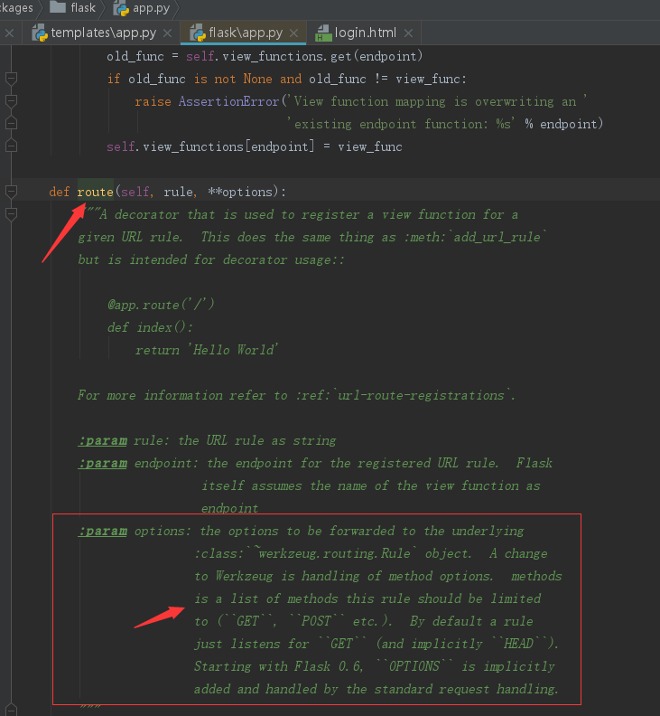

<center><h1>Flask 请求方式</h1></center>

## 1. 介绍
&#160; &#160; &#160; &#160;明确Request这是个对象，不管使用PHP还是python还是什么java语言，虽然request这个对象可能叫的名字不一样，（在其他语言中可能叫什么HttpRequest），但是原理都是差不多。我们客户端发送请求给服务器，发送的就是这个Request对象。我们不能简单的以为我们在地址栏打了一行：www.xxxx.com 就以为请求就这点东西，其实Request对象里面包含了你要发送给服务器的很多东西。这节内容和之前的基础知识中的Http相呼应。

&#160; &#160; &#160; &#160;在Flask中，Request对象就叫做request，可以直接引用

```
    from flask import request
```

## 2. 代码

### 2.1 python code
app.py
```
#!/usr/bin/python
# _*_ coding: utf-8 _*_
"""
@Time    : 2019/2/18 13:03
@Software: PyCharm
"""
from flask import Flask, render_template, redirect

app = Flask(__name__)


@app.route('/')
def hello_world():

    return 'Hello World!'


@app.route('/hello')
def hello():

    return 'Hello!'


@app.route('/login')
def login():
    return render_template('login.html')


@app.route('/home')
def home():
    return redirect('/login')


if __name__ == '__main__':
    app.run(host='0.0.0.0', port=9527, debug=True)
    # app.run(host='0.0.0.0', debug=True)

# wsgi 应用程序网关接口，把你的请求处理后发送给对于的app中
# werkzeug Flask使用的
```

### 2.2 html code

log.html
```
<!DOCTYPE html>
<html lang="en">
<head>
    <meta charset="UTF-8">
    <title>Title</title>
</head>
<body>
<h1>登录页面</h1>
<form action="/login" method="post">
    <p>
        用户名: <input type="text" name="username">
    </p>
    <p>
        密码: <input type="password" name="pwd">
    </p>
    <p><input type="submit"> 登录</p>
</form>
</body>
</html>
```

### 2.3 运行代码

```
root@leco:~/code/flask# python app.py
 * Running on http://0.0.0.0:9527/ (Press CTRL+C to quit)
 * Restarting with stat
 * Debugger is active!
 * Debugger PIN: 231-067-023
192.168.5.110 - - [05/Mar/2019 13:32:03] "GET / HTTP/1.1" 200 -
192.168.5.1 - - [05/Mar/2019 13:33:34] "POST / HTTP/1.1" 405 -

```

### 2.4 测试
#### 2.4.1 GET 测试

```
root@leco:~/book/books/docs/mysql# curl 192.168.5.110:9527
Hello World!root@leco:~/book/books/docs/mysql#
```
GET请求过去是允许的。

#### 2.4.2 POST 测试

```
root@leco:~/book/books/docs/mysql#
root@leco:~/book/books/docs/mysql# curl 192.168.5.110:9527 -X POST -d 'title=123'
<!DOCTYPE HTML PUBLIC "-//W3C//DTD HTML 3.2 Final//EN">
<title>405 Method Not Allowed</title>
<h1>Method Not Allowed</h1>
<p>The method is not allowed for the requested URL.</p>
```
POST 请求过去是不允许的。

!!! note "原因"
    ```python
    1. flask 没有methods修饰的时候。默认是只接受GET请求
    2. 要是其他请求可行，需要添加methods,如methods=['GET', 'POST']
    ```

原因分析，查看源码,错误分析 点击route查看采参数



!!! note "注意"
    ```python
         methods
                is a list of methods this rule should be limited to (``GET``, ``POST`` etc.).
    ```

## 3. 代码修改

```
#!/usr/bin/python
# _*_ coding: utf-8 _*_
"""
@Time    : 2019/3/5 13:41
@File    : app.py
@Software: PyCharm
"""

from flask import Flask, render_template, redirect,request

app = Flask(__name__)


@app.route('/')
def hello_world():

    return 'Hello World!'


@app.route('/hello')
def hello():

    return 'Hello!'


@app.route('/login', methods=['GET', 'POST'])
def login():
    print('你访问了login函数')
    if request.method == 'GET':
        return "GET"
    elif request.method == "POST":
        return "POST"


@app.route('/home')
def home():
    return redirect('/login')


if __name__ == '__main__':
    app.run(host='0.0.0.0', port=9527, debug=True)
    # app.run(host='0.0.0.0', debug=True)

# wsgi 应用程序网关接口，把你的请求处理后发送给对于的app中
# werkzeug Flask使用的
```

测试

```
root@leco:~/book/books/docs/mysql# curl 192.168.5.110:9527/login
GETroot@leco:~/book/books/docs/mysql#
root@leco:~/book/books/docs/mysql#
root@leco:~/book/books/docs/mysql#
root@leco:~/book/books/docs/mysql# curl 192.168.5.110:9527/login -X POST -d 'title=123'
POSTroot@leco:~/book/books/docs/mysql#
```

所以可以接受GET,POST等其他方法了。


## 4. 总结
&#160; &#160; &#160; &#160; 要想客户端能使用哪种方式访问。我们就在methods后面的列表中添加。


