<center><h1> NodePad++ 插件 </h1></center>

## 1. 起因
&#160; &#160; &#160; 在调试远程Linux代码的时候。通常是登录到服务器。使用vim这样的软件调试代码。但是在调试大的工程的时候，修改文件特别麻烦，尤其你vim这样的软件不熟的话，你会抓狂。此时有个windows软件你值得拥有。那就是NodePad++结和插件NppFTP，就可以在本地编辑远程文件(通过上传、下载远程文件直接在NodePad++中修改)

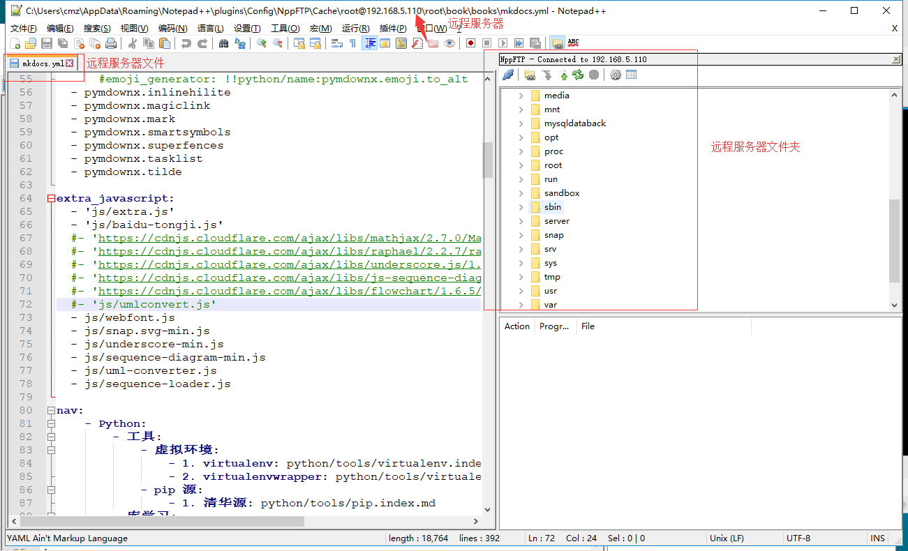

> 本教程适合Windows远程修改远程Linux服务器上的文件。

## 2. Linux
### 2.1 信息

&#160; &#160; &#160; 以下是远程Linux服务器的相关信息。需要IP，Linux的ssh登录账号和密码
```
root@leco:~# id
uid=0(root) gid=0(root) 组=0(root)
root@leco:~# ifconfig | grep 192.168.5.110
          inet 地址:192.168.5.110  广播:192.168.5.255  掩码:255.255.255.0
```
> 你的ssh远程连接Linux服务器的账号决定你能编辑远程服务器的文件的权限，所以建议你的这用户能有编辑的文件的权限。我接下我以root用户去操作，你的以你实际情况来


## 3. Windows
### 3.1 安装nodepad

 &#160; &#160; 首先安装好NodePad++，请==选择32位==版本[64位的好像不可以安装这个插件]，安装好后，双击打开NodePad++，你的界面如下：

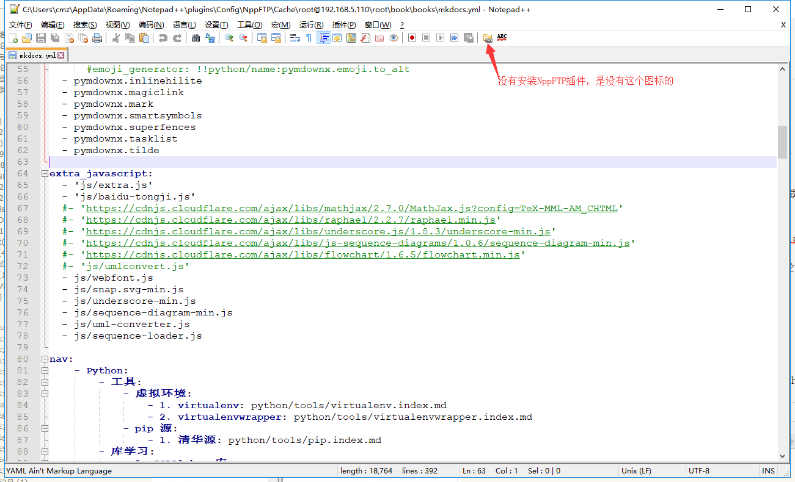

### 3.2 安装NppFTP插件
 &#160; &#160; 点击图标右上角的?号，选择 获取插件选项。
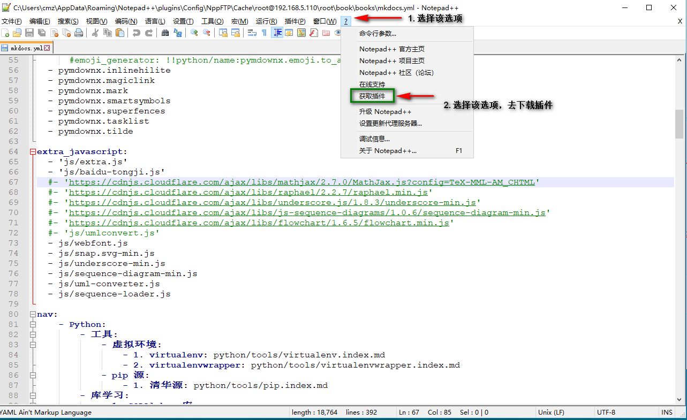

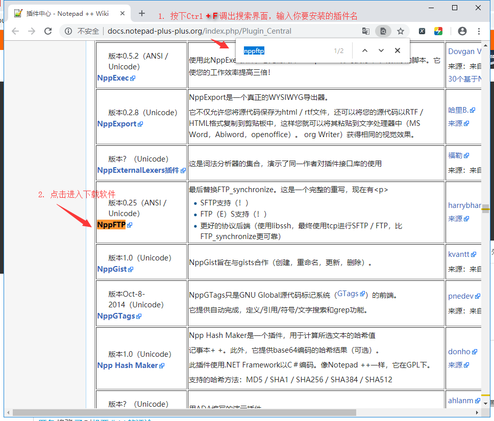


等下插件下载完毕。

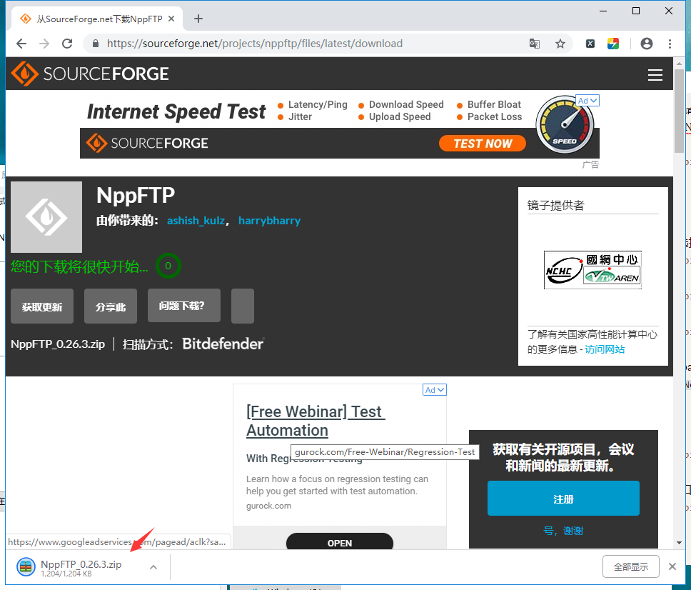

 &#160; &#160; 下载好后，直接解压到notepad++安装目录的插件文件夹 的plugins。比如我的安装路径是: `C:\Program Files (x86)\Notepad++\plugins`,你的根据你的来。找到安装路径下面的plugins文件夹，然后把解压后的文件`NppFTP.dll` 直接拷贝到plugins下面，如下图:

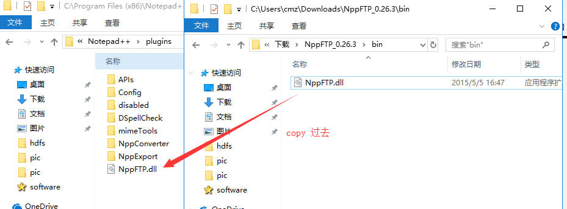

 &#160; &#160; 然后重启NodePad++软件。


以上两种方式都可以调出NppFTP选项。到此安装就成功了，下面开始讲解，如何配置。

### 3.3 NppFTP配置

 &#160; &#160; 新安装的NppFTP插件后，打开NppFTP插件选项如下类似，右侧是空白的。需要你配置。

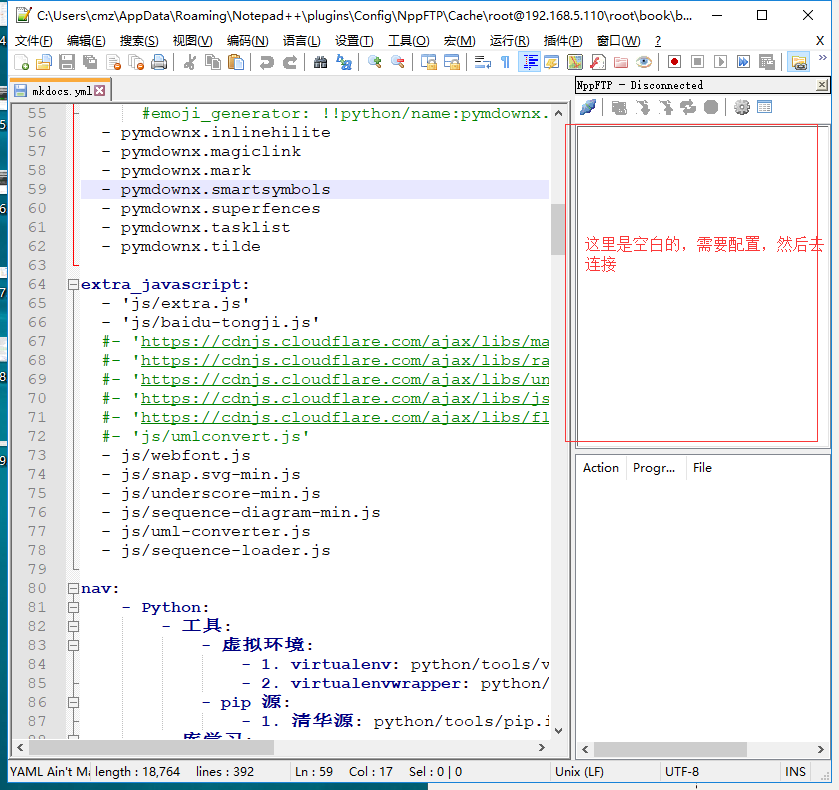

选项Profile settings进行配置。如下图:


点击新建Add New

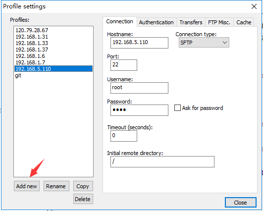

接下来给你这新建的条目起一个名字。我建议写IP地址，以后就知道你这个是链接到哪里机器的。

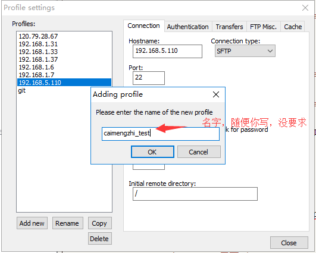


然后关闭，回到主界面。连接

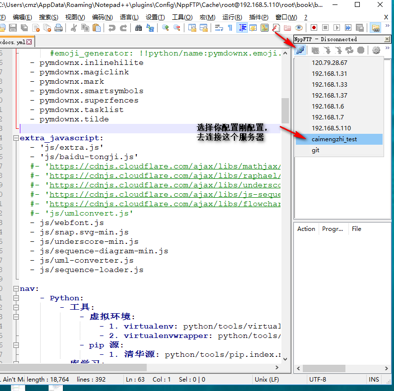

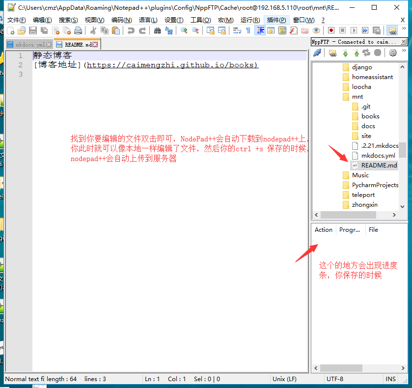

你操作都会有记录，打开该按钮，就可以看到你的所有操作，

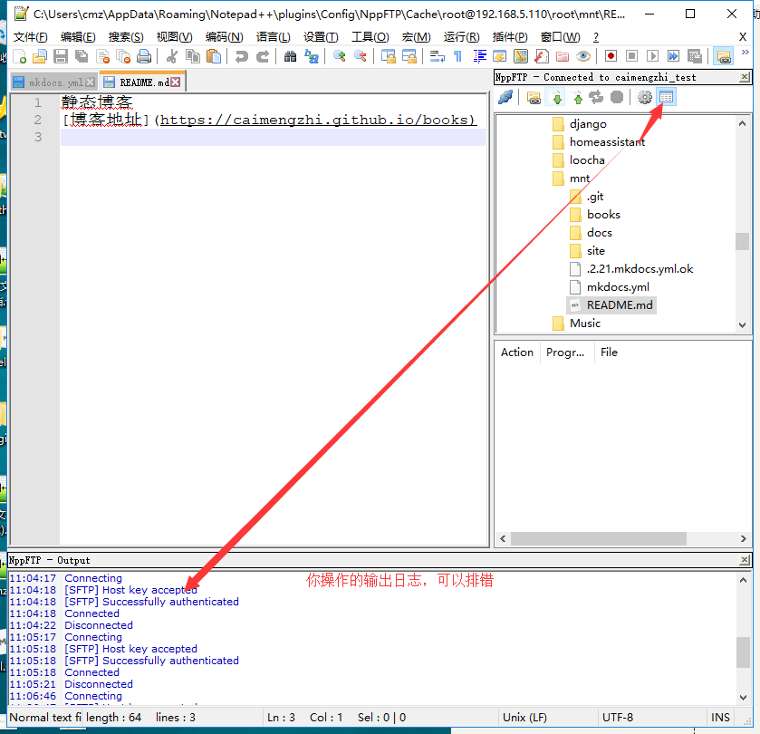

> 常见的问题就是你的ssh登录linux服务器的账号，没有编辑该文件的权限，总是会呗拒接。你此时就需要在Linux服务器上授权该用户去编辑该文件

```
# 授权taotaolinux用户和taotaolinux用户组可以操作files_dir文件下所有文件
chown -R taotaolinux.taotaolinux files_dir
```


